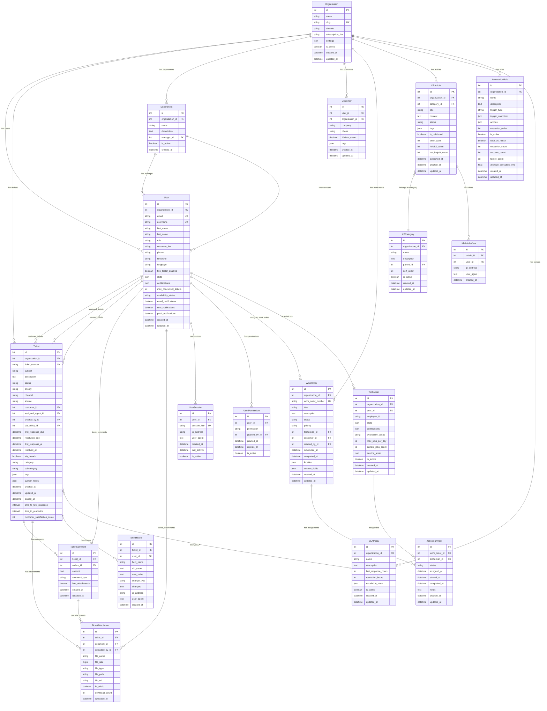
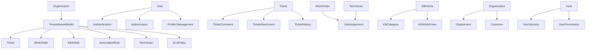
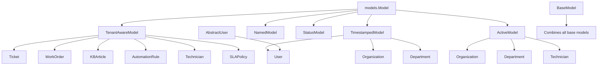
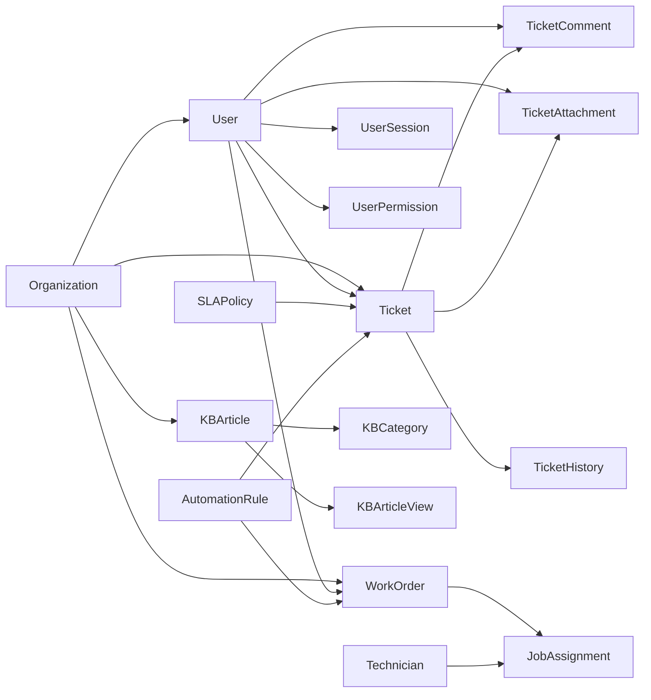
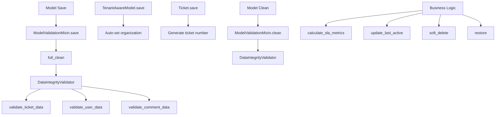
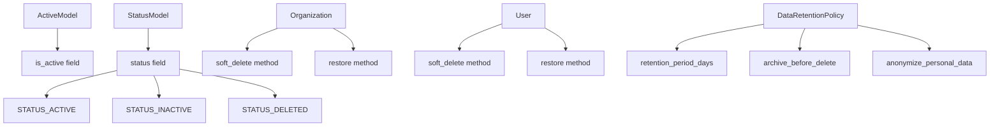

# Database Model Relationship Diagram

## Core Entity Relationships

## Multi-Tenant Architecture

## Model Inheritance Hierarchy

## Data Flow Relationships

## Validation and Hooks Flow

## Soft Delete Implementation

## Security and Access Control

```mermaid
graph TD
    A[User Role] --> B[admin]
    A --> C[manager]
    A --> D[agent]
    A --> E[customer]
    
    F[limit_choices_to] --> G[role: customer]
    F --> H[role__in: admin, manager, agent]
    
    I[Organization] --> J[Multi-tenant isolation]
    K[User] --> L[Role-based access]
    M[Ticket] --> N[Customer can only see own tickets]
    M --> O[Agent can see assigned tickets]
    M --> P[Admin can see all tickets]
    
    Q[UserSession] --> R[Session management]
    S[UserPermission] --> T[Custom permissions]
    U[DataRetentionPolicy] --> V[Data lifecycle management]
```

This comprehensive model relationship diagram shows:

1. **Core Entity Relationships:** How all models connect
2. **Multi-Tenant Architecture:** Organization-based isolation
3. **Model Inheritance:** Base model hierarchy
4. **Data Flow:** How data flows between entities
5. **Validation and Hooks:** Model lifecycle management
6. **Soft Delete Implementation:** Data retention patterns
7. **Security and Access Control:** Role-based permissions

The database model architecture is well-designed with proper relationships, validation, and security controls! 🎉
