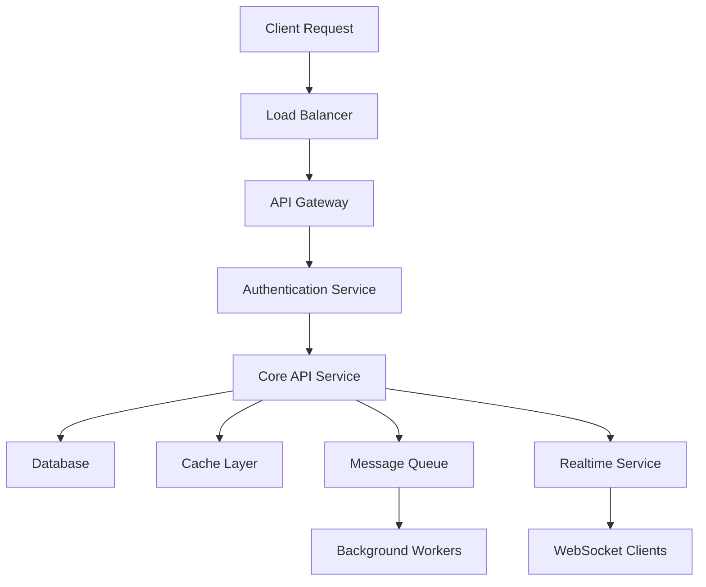
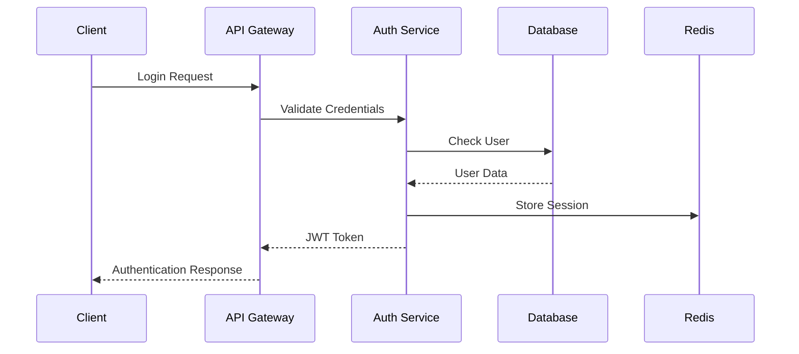
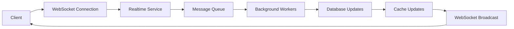

# 🏗️ **Project Architecture Overview**

**Version:** 1.0.0  
**Last Updated:** October 13, 2025

## 📋 **Table of Contents**

- [System Overview](#system-overview)
- [Architecture Principles](#architecture-principles)
- [System Components](#system-components)
- [Technology Stack](#technology-stack)
- [Data Flow](#data-flow)
- [Security Architecture](#security-architecture)
- [Scalability Design](#scalability-design)
- [Deployment Architecture](#deployment-architecture)
- [Monitoring & Observability](#monitoring--observability)
- [Development Workflow](#development-workflow)

---

## 🎯 **System Overview**

The Helpdesk Platform is a comprehensive, multi-tenant helpdesk and field service management system built with modern microservices architecture. It provides end-to-end solutions for customer support, field service operations, and business intelligence.

### **Core Capabilities**
- **Multi-tenant Architecture**: Isolated tenant data and configurations
- **Real-time Communication**: WebSocket-based real-time updates
- **AI/ML Integration**: Intelligent automation and predictive analytics
- **Field Service Management**: Complete field service lifecycle management
- **Advanced Analytics**: Business intelligence and reporting
- **Mobile Support**: Responsive design and mobile applications

### **Key Features**
- Ticket Management System
- Field Service Operations
- Knowledge Base Management
- AI-Powered Automation
- Real-time Notifications
- Advanced Analytics
- Multi-channel Support
- Workflow Automation

---

## 🏛️ **Architecture Principles**

### **1. Microservices Architecture**
- **Service Independence**: Each service can be developed, deployed, and scaled independently
- **Domain-Driven Design**: Services organized around business domains
- **API-First Design**: All services expose well-defined APIs
- **Event-Driven Communication**: Services communicate through events

### **2. Multi-Tenancy**
- **Data Isolation**: Complete tenant data separation
- **Configuration Management**: Tenant-specific configurations
- **Resource Sharing**: Efficient resource utilization
- **Security Boundaries**: Strict tenant isolation

### **3. Scalability**
- **Horizontal Scaling**: Services can scale independently
- **Load Distribution**: Intelligent load balancing
- **Caching Strategy**: Multi-layer caching implementation
- **Database Sharding**: Tenant-based data partitioning

### **4. Security**
- **Zero Trust Architecture**: No implicit trust between services
- **Encryption**: Data encryption at rest and in transit
- **Authentication**: Multi-factor authentication support
- **Authorization**: Role-based access control (RBAC)

---

## 🧩 **System Components**

### **Frontend Layer**

#### **Customer Portal** (`customer-portal/`)
- **Technology**: React 19, TypeScript, Vite
- **Purpose**: Customer-facing interface for ticket management
- **Features**:
  - Ticket creation and tracking
  - Knowledge base access
  - Real-time notifications
  - Mobile-responsive design

#### **Admin Dashboard** (`admin-dashboard/`)
- **Technology**: React 19, TypeScript, Vite
- **Purpose**: Administrative interface for system management
- **Features**:
  - User management
  - System configuration
  - Analytics dashboard
  - Workflow management

### **Backend Services**

#### **Core API Service** (`core/`)
- **Technology**: Django 4.2, Python 3.11
- **Purpose**: Main business logic and API endpoints
- **Features**:
  - RESTful API endpoints
  - Authentication and authorization
  - Business logic implementation
  - Database management

#### **AI/ML Service** (`ai-service/`)
- **Technology**: FastAPI, Python 3.11
- **Purpose**: AI and machine learning capabilities
- **Features**:
  - Natural language processing
  - Predictive analytics
  - Computer vision
  - Automation workflows

#### **Realtime Service** (`realtime-service/`)
- **Technology**: Node.js, Express, Socket.io
- **Purpose**: Real-time communication and notifications
- **Features**:
  - WebSocket connections
  - Real-time updates
  - Push notifications
  - Live chat support

### **Data Layer**

#### **Primary Database**
- **Technology**: PostgreSQL 15 with PostGIS
- **Purpose**: Main application data storage
- **Features**:
  - ACID compliance
  - Spatial data support
  - Full-text search
  - Backup and recovery

#### **Cache Layer**
- **Technology**: Redis 7
- **Purpose**: High-performance caching and session storage
- **Features**:
  - In-memory storage
  - Pub/Sub messaging
  - Session management
  - Rate limiting

#### **Search Engine**
- **Technology**: Elasticsearch
- **Purpose**: Full-text search and analytics
- **Features**:
  - Advanced search capabilities
  - Real-time indexing
  - Analytics and reporting
  - Multi-language support

### **Infrastructure Layer**

#### **Message Queue**
- **Technology**: Celery with Redis broker
- **Purpose**: Asynchronous task processing
- **Features**:
  - Background job processing
  - Scheduled tasks
  - Task monitoring
  - Error handling

#### **File Storage**
- **Technology**: AWS S3 / MinIO
- **Purpose**: File and media storage
- **Features**:
  - Scalable storage
  - CDN integration
  - Backup and versioning
  - Access control

#### **Monitoring & Logging**
- **Technology**: Prometheus, Grafana, ELK Stack
- **Purpose**: System monitoring and observability
- **Features**:
  - Metrics collection
  - Log aggregation
  - Alerting
  - Performance monitoring

---

## 🛠️ **Technology Stack**

### **Frontend Technologies**
```yaml
Framework: React 19
Language: TypeScript 5.9
Build Tool: Vite 6.0
Styling: Tailwind CSS 3.4
State Management: React Query (TanStack Query)
Routing: React Router 7
Testing: Vitest, React Testing Library
```

### **Backend Technologies**
```yaml
Framework: Django 4.2
Language: Python 3.11
API Framework: Django REST Framework
AI/ML: FastAPI, Transformers, PyTorch
Realtime: Node.js, Express, Socket.io
Database: PostgreSQL 15, Redis 7
Search: Elasticsearch
```

### **Infrastructure Technologies**
```yaml
Containerization: Docker, Docker Compose
Orchestration: Kubernetes (optional)
Cloud: AWS, Azure, GCP
CI/CD: GitHub Actions, GitLab CI
Monitoring: Prometheus, Grafana
Logging: ELK Stack
```

### **Development Tools**
```yaml
Version Control: Git
Package Management: npm, pip
Code Quality: ESLint, Prettier, Black, isort
Testing: Jest, pytest, Cypress
Documentation: JSDoc, Sphinx, Swagger
```

---

## 🔄 **Data Flow**

### **Request Flow**


### **Authentication Flow**


### **Real-time Communication Flow**


---

## 🔒 **Security Architecture**

### **Security Layers**

#### **1. Network Security**
- **Firewall**: Network-level protection
- **DDoS Protection**: Distributed denial-of-service mitigation
- **SSL/TLS**: End-to-end encryption
- **VPN Access**: Secure remote access

#### **2. Application Security**
- **Authentication**: Multi-factor authentication
- **Authorization**: Role-based access control
- **Input Validation**: Comprehensive input sanitization
- **SQL Injection Prevention**: Parameterized queries

#### **3. Data Security**
- **Encryption at Rest**: Database encryption
- **Encryption in Transit**: TLS encryption
- **Data Masking**: Sensitive data protection
- **Audit Logging**: Comprehensive audit trails

### **Security Best Practices**
- **Zero Trust Architecture**: No implicit trust
- **Least Privilege**: Minimal required permissions
- **Regular Security Audits**: Ongoing security assessments
- **Vulnerability Management**: Proactive vulnerability handling

---

## 📈 **Scalability Design**

### **Horizontal Scaling**
- **Stateless Services**: Services designed for horizontal scaling
- **Load Balancing**: Intelligent request distribution
- **Auto-scaling**: Dynamic resource allocation
- **Database Sharding**: Tenant-based data partitioning

### **Performance Optimization**
- **Caching Strategy**: Multi-layer caching
- **CDN Integration**: Global content delivery
- **Database Optimization**: Query optimization and indexing
- **Resource Monitoring**: Continuous performance monitoring

### **Capacity Planning**
- **Resource Metrics**: CPU, memory, storage monitoring
- **Performance Benchmarks**: Load testing and optimization
- **Growth Projections**: Capacity planning based on usage patterns
- **Cost Optimization**: Efficient resource utilization

---

## 🚀 **Deployment Architecture**

### **Environment Strategy**

#### **Development Environment**
- **Local Development**: Docker Compose setup
- **Feature Branches**: Isolated development environments
- **Testing**: Automated testing pipeline
- **Code Review**: Peer review process

#### **Staging Environment**
- **Production-like Setup**: Mirrors production environment
- **Integration Testing**: End-to-end testing
- **Performance Testing**: Load and stress testing
- **Security Testing**: Vulnerability assessments

#### **Production Environment**
- **High Availability**: Multi-region deployment
- **Disaster Recovery**: Backup and recovery procedures
- **Monitoring**: Comprehensive monitoring and alerting
- **Maintenance**: Scheduled maintenance windows

### **Deployment Strategies**
- **Blue-Green Deployment**: Zero-downtime deployments
- **Canary Releases**: Gradual rollout strategy
- **Rolling Updates**: Incremental updates
- **Feature Flags**: Dynamic feature toggling

---

## 📊 **Monitoring & Observability**

### **Metrics Collection**
- **Application Metrics**: Performance and usage metrics
- **Infrastructure Metrics**: System resource utilization
- **Business Metrics**: Key performance indicators
- **Custom Metrics**: Application-specific metrics

### **Logging Strategy**
- **Structured Logging**: JSON-formatted logs
- **Log Aggregation**: Centralized log collection
- **Log Analysis**: Automated log analysis
- **Retention Policies**: Log retention and archival

### **Alerting System**
- **Threshold-based Alerts**: Performance threshold monitoring
- **Anomaly Detection**: Unusual pattern detection
- **Escalation Procedures**: Alert escalation workflows
- **Notification Channels**: Multiple notification methods

---

## 🔧 **Development Workflow**

### **Code Management**
- **Git Workflow**: Feature branch development
- **Code Review**: Pull request reviews
- **Automated Testing**: CI/CD pipeline
- **Documentation**: Automated documentation generation

### **Quality Assurance**
- **Code Standards**: Linting and formatting
- **Testing Strategy**: Unit, integration, and E2E testing
- **Security Scanning**: Automated security checks
- **Performance Testing**: Load and stress testing

### **Release Management**
- **Version Control**: Semantic versioning
- **Release Notes**: Automated release documentation
- **Rollback Procedures**: Quick rollback capabilities
- **Feature Flags**: Dynamic feature management

---

## 📚 **Documentation Structure**

### **Technical Documentation**
- **API Documentation**: Complete API reference
- **Database Schema**: Entity relationship diagrams
- **Component Documentation**: Frontend component library
- **Deployment Guides**: Step-by-step deployment procedures

### **User Documentation**
- **User Manuals**: End-user guides
- **Admin Guides**: Administrative procedures
- **Developer Guides**: Development setup and guidelines
- **Troubleshooting**: Common issues and solutions

---

## 🔮 **Future Roadmap**

### **Short-term Goals (3-6 months)**
- **Microservices Migration**: Complete service separation
- **Performance Optimization**: Enhanced performance monitoring
- **Security Enhancements**: Advanced security features
- **Mobile Applications**: Native mobile apps

### **Long-term Goals (6-12 months)**
- **AI/ML Integration**: Advanced AI capabilities
- **Multi-region Deployment**: Global deployment strategy
- **Advanced Analytics**: Business intelligence features
- **Third-party Integrations**: External service integrations

---

## 📞 **Support & Resources**

### **Development Team**
- **Architecture Team**: System design and planning
- **Backend Team**: API and service development
- **Frontend Team**: User interface development
- **DevOps Team**: Infrastructure and deployment

### **Resources**
- **Architecture Decision Records**: [docs/architecture/](docs/architecture/)
- **Technical Specifications**: [docs/technical/](docs/technical/)
- **API Documentation**: [docs/api/](docs/api/)
- **Deployment Guides**: [docs/deployment/](docs/deployment/)

---

**Last Updated**: October 13, 2025  
**Next Review**: November 13, 2025  
**Maintained By**: Architecture Team
