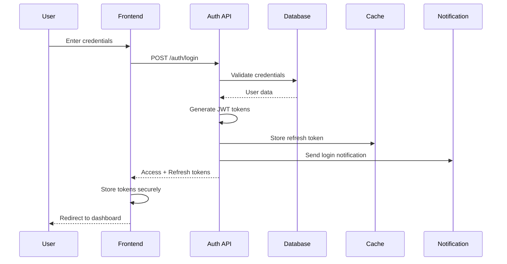
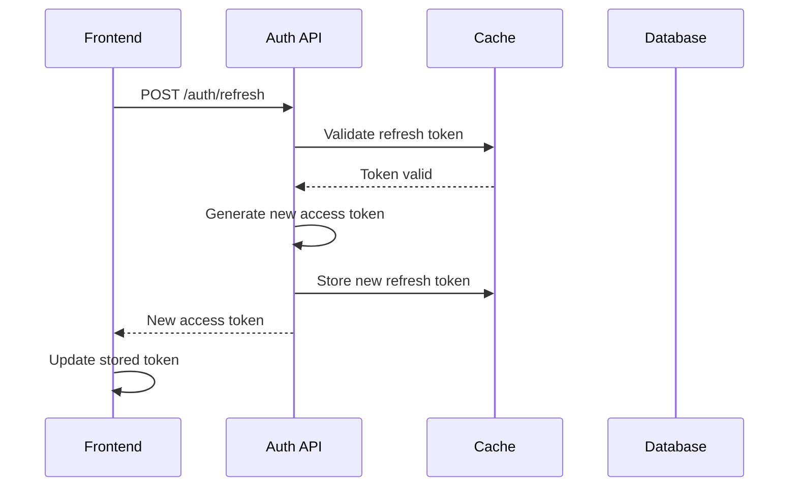
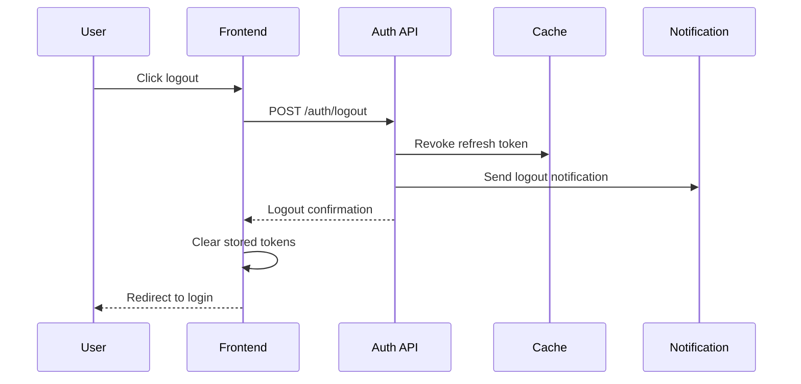
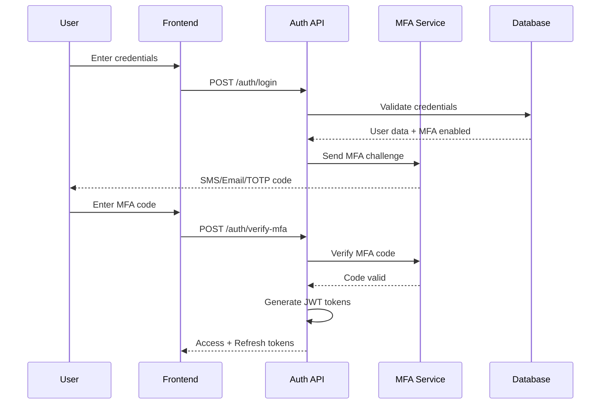

# 🔐 **Authentication Flow Documentation**

**Version:** 1.0.0  
**Last Updated:** October 13, 2025

## 📋 **Table of Contents**

- [Authentication Overview](#authentication-overview)
- [Authentication Methods](#authentication-methods)
- [Authentication Flow Diagrams](#authentication-flow-diagrams)
- [JWT Token Management](#jwt-token-management)
- [Session Management](#session-management)
- [Authorization Levels](#authorization-levels)
- [Security Features](#security-features)
- [Implementation Examples](#implementation-examples)
- [Error Handling](#error-handling)
- [Testing Authentication](#testing-authentication)

---

## 🎯 **Authentication Overview**

The Helpdesk Platform implements a comprehensive authentication system that supports multiple authentication methods, role-based access control, and advanced security features. The system is designed for multi-tenant architecture with secure token-based authentication.

### **Authentication Features**
- **Multi-Method Support**: JWT, API Key, Session-based authentication
- **Role-Based Access Control**: Granular permissions system
- **Multi-Factor Authentication**: TOTP, SMS, Email verification
- **Session Management**: Secure session handling with refresh tokens
- **Password Security**: Bcrypt hashing, password policies
- **Account Security**: Account lockout, suspicious activity detection
- **Audit Logging**: Comprehensive authentication audit trails

### **Security Standards**
- **OWASP Compliance**: Following OWASP security guidelines
- **JWT Security**: Secure token generation and validation
- **HTTPS Only**: All authentication over secure connections
- **Rate Limiting**: Protection against brute force attacks
- **CSRF Protection**: Cross-site request forgery prevention

---

## 🔑 **Authentication Methods**

### **1. JWT Token Authentication**

#### **Token Structure**
```json
{
  "header": {
    "alg": "HS256",
    "typ": "JWT"
  },
  "payload": {
    "user_id": "123e4567-e89b-12d3-a456-426614174000",
    "email": "user@example.com",
    "organization_id": "org_123",
    "roles": ["agent", "customer"],
    "permissions": ["read:tickets", "write:tickets"],
    "iat": 1640995200,
    "exp": 1640998800,
    "jti": "token_123"
  }
}
```

#### **Token Lifecycle**
- **Access Token**: Short-lived (15 minutes), for API requests
- **Refresh Token**: Long-lived (7 days), for token renewal
- **Token Rotation**: New refresh token on each renewal
- **Token Revocation**: Immediate invalidation on logout

### **2. API Key Authentication**

#### **API Key Structure**
```typescript
interface APIKey {
  id: string;
  name: string;
  key: string; // Hashed version stored
  user_id: string;
  organization_id: string;
  permissions: string[];
  expires_at?: Date;
  last_used_at?: Date;
  is_active: boolean;
  created_at: Date;
}
```

#### **API Key Usage**
```http
X-API-Key: hd_live_1234567890abcdef1234567890abcdef
Authorization: Bearer <jwt_token>
```

### **3. Session-Based Authentication**

#### **Session Configuration**
```python
# Django settings
SESSION_ENGINE = 'django.contrib.sessions.backends.cache'
SESSION_CACHE_ALIAS = 'default'
SESSION_COOKIE_AGE = 3600  # 1 hour
SESSION_COOKIE_SECURE = True
SESSION_COOKIE_HTTPONLY = True
SESSION_COOKIE_SAMESITE = 'Strict'
```

---

## 🔄 **Authentication Flow Diagrams**

### **Login Flow**



### **Token Refresh Flow**



### **Logout Flow**



### **Multi-Factor Authentication Flow**



---

## 🎫 **JWT Token Management**

### **Token Generation**

#### **Access Token Generation**
```python
import jwt
from datetime import datetime, timedelta
from django.conf import settings

def generate_access_token(user, organization):
    payload = {
        'user_id': str(user.id),
        'email': user.email,
        'organization_id': str(organization.id),
        'roles': [role.name for role in user.roles.all()],
        'permissions': get_user_permissions(user),
        'iat': datetime.utcnow(),
        'exp': datetime.utcnow() + timedelta(minutes=15),
        'jti': generate_jti(),
        'type': 'access'
    }
    
    return jwt.encode(
        payload, 
        settings.SECRET_KEY, 
        algorithm='HS256'
    )
```

#### **Refresh Token Generation**
```python
def generate_refresh_token(user, organization):
    payload = {
        'user_id': str(user.id),
        'organization_id': str(organization.id),
        'iat': datetime.utcnow(),
        'exp': datetime.utcnow() + timedelta(days=7),
        'jti': generate_jti(),
        'type': 'refresh'
    }
    
    token = jwt.encode(
        payload, 
        settings.SECRET_KEY, 
        algorithm='HS256'
    )
    
    # Store in cache for revocation
    cache.set(f"refresh_token:{token}", user.id, timeout=7*24*3600)
    
    return token
```

### **Token Validation**

#### **Middleware for Token Validation**
```python
class JWTAuthenticationMiddleware:
    def __init__(self, get_response):
        self.get_response = get_response

    def __call__(self, request):
        token = self.get_token_from_request(request)
        
        if token:
            try:
                payload = jwt.decode(
                    token, 
                    settings.SECRET_KEY, 
                    algorithms=['HS256']
                )
                
                if payload.get('type') != 'access':
                    raise jwt.InvalidTokenError('Invalid token type')
                
                request.user = self.get_user_from_payload(payload)
                request.organization = self.get_organization_from_payload(payload)
                
            except jwt.ExpiredSignatureError:
                return self.handle_token_expired(request)
            except jwt.InvalidTokenError:
                return self.handle_invalid_token(request)
        
        return self.get_response(request)
```

#### **Token Refresh Logic**
```python
def refresh_access_token(refresh_token):
    try:
        payload = jwt.decode(
            refresh_token, 
            settings.SECRET_KEY, 
            algorithms=['HS256']
        )
        
        if payload.get('type') != 'refresh':
            raise jwt.InvalidTokenError('Invalid token type')
        
        # Check if token is revoked
        if not cache.get(f"refresh_token:{refresh_token}"):
            raise jwt.InvalidTokenError('Token revoked')
        
        user = User.objects.get(id=payload['user_id'])
        organization = Organization.objects.get(id=payload['organization_id'])
        
        # Generate new tokens
        new_access_token = generate_access_token(user, organization)
        new_refresh_token = generate_refresh_token(user, organization)
        
        # Revoke old refresh token
        cache.delete(f"refresh_token:{refresh_token}")
        
        return {
            'access_token': new_access_token,
            'refresh_token': new_refresh_token,
            'expires_in': 900  # 15 minutes
        }
        
    except jwt.ExpiredSignatureError:
        raise AuthenticationError('Refresh token expired')
    except jwt.InvalidTokenError:
        raise AuthenticationError('Invalid refresh token')
```

---

## 👥 **Session Management**

### **Session Configuration**

#### **Django Session Settings**
```python
# settings.py
SESSION_ENGINE = 'django.contrib.sessions.backends.cache'
SESSION_CACHE_ALIAS = 'default'
SESSION_COOKIE_AGE = 3600  # 1 hour
SESSION_COOKIE_SECURE = True
SESSION_COOKIE_HTTPONLY = True
SESSION_COOKIE_SAMESITE = 'Strict'
SESSION_SAVE_EVERY_REQUEST = True
SESSION_EXPIRE_AT_BROWSER_CLOSE = False
```

#### **Session Data Structure**
```python
# Session data stored in cache
session_data = {
    'user_id': '123e4567-e89b-12d3-a456-426614174000',
    'organization_id': 'org_123',
    'roles': ['agent', 'customer'],
    'permissions': ['read:tickets', 'write:tickets'],
    'last_activity': datetime.utcnow().isoformat(),
    'login_time': datetime.utcnow().isoformat(),
    'ip_address': '192.168.1.1',
    'user_agent': 'Mozilla/5.0...'
}
```

### **Session Security**

#### **Session Validation**
```python
class SessionSecurityMiddleware:
    def __init__(self, get_response):
        self.get_response = get_response

    def __call__(self, request):
        if request.user.is_authenticated:
            # Check session timeout
            if self.is_session_expired(request):
                request.session.flush()
                return redirect('login')
            
            # Check for suspicious activity
            if self.detect_suspicious_activity(request):
                self.handle_suspicious_activity(request)
            
            # Update last activity
            request.session['last_activity'] = datetime.utcnow().isoformat()
        
        return self.get_response(request)
    
    def is_session_expired(self, request):
        last_activity = request.session.get('last_activity')
        if not last_activity:
            return True
        
        last_activity = datetime.fromisoformat(last_activity)
        return datetime.utcnow() - last_activity > timedelta(hours=1)
    
    def detect_suspicious_activity(self, request):
        # Check for IP changes
        current_ip = self.get_client_ip(request)
        stored_ip = request.session.get('ip_address')
        
        if stored_ip and current_ip != stored_ip:
            return True
        
        # Check for user agent changes
        current_ua = request.META.get('HTTP_USER_AGENT', '')
        stored_ua = request.session.get('user_agent')
        
        if stored_ua and current_ua != stored_ua:
            return True
        
        return False
```

---

## 🛡️ **Authorization Levels**

### **Role-Based Access Control (RBAC)**

#### **Role Definitions**
```python
class Role(models.Model):
    name = models.CharField(max_length=50, unique=True)
    description = models.TextField()
    permissions = models.ManyToManyField('Permission')
    organization = models.ForeignKey('Organization', on_delete=models.CASCADE)
    is_active = models.BooleanField(default=True)
    created_at = models.DateTimeField(auto_now_add=True)

class Permission(models.Model):
    name = models.CharField(max_length=100, unique=True)
    description = models.TextField()
    resource = models.CharField(max_length=50)  # tickets, users, etc.
    action = models.CharField(max_length=20)    # read, write, delete, etc.
    created_at = models.DateTimeField(auto_now_add=True)
```

#### **Permission System**
```python
# Permission examples
PERMISSIONS = [
    # Ticket permissions
    ('tickets', 'read', 'Can view tickets'),
    ('tickets', 'write', 'Can create and edit tickets'),
    ('tickets', 'delete', 'Can delete tickets'),
    ('tickets', 'assign', 'Can assign tickets'),
    
    # User permissions
    ('users', 'read', 'Can view users'),
    ('users', 'write', 'Can create and edit users'),
    ('users', 'delete', 'Can delete users'),
    ('users', 'manage_roles', 'Can manage user roles'),
    
    # Organization permissions
    ('organization', 'read', 'Can view organization settings'),
    ('organization', 'write', 'Can edit organization settings'),
    ('organization', 'manage_users', 'Can manage organization users'),
]
```

#### **Permission Checking**
```python
def has_permission(user, resource, action):
    """Check if user has specific permission"""
    return user.roles.filter(
        permissions__resource=resource,
        permissions__action=action,
        is_active=True
    ).exists()

def check_permission(permission):
    """Decorator for permission checking"""
    def decorator(view_func):
        def wrapper(request, *args, **kwargs):
            resource, action = permission.split(':')
            
            if not has_permission(request.user, resource, action):
                raise PermissionDenied('Insufficient permissions')
            
            return view_func(request, *args, **kwargs)
        return wrapper
    return decorator

# Usage
@check_permission('tickets:write')
def create_ticket(request):
    # Create ticket logic
    pass
```

### **Organization-Based Access Control**

#### **Multi-Tenant Security**
```python
class OrganizationMiddleware:
    def __init__(self, get_response):
        self.get_response = get_response

    def __call__(self, request):
        if request.user.is_authenticated:
            # Ensure user can only access their organization's data
            request.organization = request.user.organization
            
            # Add organization filter to all queries
            request.organization_filter = {
                'organization': request.organization
            }
        
        return self.get_response(request)
```

#### **Data Isolation**
```python
class OrganizationQuerySet(models.QuerySet):
    def filter_by_organization(self, organization):
        return self.filter(organization=organization)

class TicketManager(models.Manager):
    def get_queryset(self):
        return OrganizationQuerySet(self.model, using=self._db)
    
    def for_organization(self, organization):
        return self.get_queryset().filter_by_organization(organization)

class Ticket(models.Model):
    organization = models.ForeignKey('Organization', on_delete=models.CASCADE)
    # ... other fields
    
    objects = TicketManager()
```

---

## 🔒 **Security Features**

### **Password Security**

#### **Password Hashing**
```python
from django.contrib.auth.hashers import make_password, check_password
import bcrypt

class User(AbstractUser):
    def set_password(self, raw_password):
        # Use bcrypt for password hashing
        salt = bcrypt.gensalt()
        hashed = bcrypt.hashpw(raw_password.encode('utf-8'), salt)
        self.password = hashed.decode('utf-8')
    
    def check_password(self, raw_password):
        return bcrypt.checkpw(
            raw_password.encode('utf-8'),
            self.password.encode('utf-8')
        )
```

#### **Password Policies**
```python
class PasswordValidator:
    def validate(self, password, user=None):
        errors = []
        
        # Minimum length
        if len(password) < 8:
            errors.append('Password must be at least 8 characters long.')
        
        # Complexity requirements
        if not re.search(r'[A-Z]', password):
            errors.append('Password must contain at least one uppercase letter.')
        
        if not re.search(r'[a-z]', password):
            errors.append('Password must contain at least one lowercase letter.')
        
        if not re.search(r'\d', password):
            errors.append('Password must contain at least one digit.')
        
        if not re.search(r'[!@#$%^&*(),.?":{}|<>]', password):
            errors.append('Password must contain at least one special character.')
        
        # Common password check
        if password.lower() in COMMON_PASSWORDS:
            errors.append('Password is too common.')
        
        if errors:
            raise ValidationError(errors)
```

### **Account Security**

#### **Account Lockout**
```python
class AccountLockoutMiddleware:
    def __init__(self, get_response):
        self.get_response = get_response

    def __call__(self, request):
        if request.user.is_authenticated:
            # Check for failed login attempts
            failed_attempts = cache.get(f"failed_attempts:{request.user.id}", 0)
            
            if failed_attempts >= 5:
                # Lock account for 30 minutes
                cache.set(
                    f"account_locked:{request.user.id}", 
                    True, 
                    timeout=1800
                )
                request.user.is_active = False
                request.user.save()
        
        return self.get_response(request)
```

#### **Suspicious Activity Detection**
```python
class SecurityMonitor:
    @staticmethod
    def detect_suspicious_activity(user, request):
        suspicious_activities = []
        
        # Check for unusual login times
        if SecurityMonitor.is_unusual_login_time():
            suspicious_activities.append('unusual_login_time')
        
        # Check for multiple failed logins
        failed_attempts = cache.get(f"failed_attempts:{user.id}", 0)
        if failed_attempts > 3:
            suspicious_activities.append('multiple_failed_logins')
        
        # Check for IP changes
        if SecurityMonitor.has_ip_changed(user, request):
            suspicious_activities.append('ip_change')
        
        # Check for user agent changes
        if SecurityMonitor.has_user_agent_changed(user, request):
            suspicious_activities.append('user_agent_change')
        
        if suspicious_activities:
            SecurityMonitor.handle_suspicious_activity(
                user, 
                request, 
                suspicious_activities
            )
    
    @staticmethod
    def handle_suspicious_activity(user, request, activities):
        # Log suspicious activity
        SecurityLog.objects.create(
            user=user,
            activity_type='suspicious_activity',
            details={'activities': activities},
            ip_address=request.META.get('REMOTE_ADDR'),
            user_agent=request.META.get('HTTP_USER_AGENT')
        )
        
        # Send security alert
        send_security_alert(user, activities)
        
        # Temporarily lock account if severe
        if 'multiple_failed_logins' in activities:
            user.is_active = False
            user.save()
```

### **Multi-Factor Authentication**

#### **TOTP Implementation**
```python
import pyotp
import qrcode
from io import BytesIO
import base64

class MFAProvider:
    @staticmethod
    def generate_secret():
        return pyotp.random_base32()
    
    @staticmethod
    def generate_qr_code(user, secret):
        totp_uri = pyotp.totp.TOTP(secret).provisioning_uri(
            name=user.email,
            issuer_name="Helpdesk Platform"
        )
        
        qr = qrcode.QRCode(version=1, box_size=10, border=5)
        qr.add_data(totp_uri)
        qr.make(fit=True)
        
        img = qr.make_image(fill_color="black", back_color="white")
        buffer = BytesIO()
        img.save(buffer, format='PNG')
        buffer.seek(0)
        
        return base64.b64encode(buffer.getvalue()).decode()
    
    @staticmethod
    def verify_totp(secret, token):
        totp = pyotp.TOTP(secret)
        return totp.verify(token, valid_window=1)
```

#### **SMS MFA**
```python
import random
from twilio.rest import Client

class SMSMFA:
    def __init__(self):
        self.client = Client(settings.TWILIO_ACCOUNT_SID, settings.TWILIO_AUTH_TOKEN)
    
    def send_code(self, phone_number):
        code = str(random.randint(100000, 999999))
        
        # Store code in cache with expiration
        cache.set(f"sms_code:{phone_number}", code, timeout=300)  # 5 minutes
        
        # Send SMS
        self.client.messages.create(
            body=f"Your verification code is: {code}",
            from_=settings.TWILIO_PHONE_NUMBER,
            to=phone_number
        )
        
        return True
    
    def verify_code(self, phone_number, code):
        stored_code = cache.get(f"sms_code:{phone_number}")
        return stored_code and stored_code == code
```

---

## 💻 **Implementation Examples**

### **Frontend Authentication**

#### **React Authentication Hook**
```typescript
interface AuthState {
  user: User | null;
  organization: Organization | null;
  isAuthenticated: boolean;
  isLoading: boolean;
  error: string | null;
}

export const useAuth = () => {
  const [state, setState] = useState<AuthState>({
    user: null,
    organization: null,
    isAuthenticated: false,
    isLoading: true,
    error: null
  });

  const login = async (credentials: LoginCredentials) => {
    try {
      setState(prev => ({ ...prev, isLoading: true, error: null }));
      
      const response = await authAPI.login(credentials);
      const { user, organization, access_token, refresh_token } = response;
      
      // Store tokens securely
      localStorage.setItem('access_token', access_token);
      localStorage.setItem('refresh_token', refresh_token);
      
      setState({
        user,
        organization,
        isAuthenticated: true,
        isLoading: false,
        error: null
      });
      
      return { user, organization };
    } catch (error) {
      setState(prev => ({
        ...prev,
        isLoading: false,
        error: error.message
      }));
      throw error;
    }
  };

  const logout = () => {
    localStorage.removeItem('access_token');
    localStorage.removeItem('refresh_token');
    
    setState({
      user: null,
      organization: null,
      isAuthenticated: false,
      isLoading: false,
      error: null
    });
  };

  const refreshToken = async () => {
    try {
      const refresh_token = localStorage.getItem('refresh_token');
      if (!refresh_token) throw new Error('No refresh token');
      
      const response = await authAPI.refreshToken(refresh_token);
      const { access_token } = response;
      
      localStorage.setItem('access_token', access_token);
      
      return access_token;
    } catch (error) {
      logout();
      throw error;
    }
  };

  // Auto-refresh token
  useEffect(() => {
    const interval = setInterval(async () => {
      if (state.isAuthenticated) {
        try {
          await refreshToken();
        } catch (error) {
          logout();
        }
      }
    }, 14 * 60 * 1000); // Refresh every 14 minutes

    return () => clearInterval(interval);
  }, [state.isAuthenticated]);

  return {
    ...state,
    login,
    logout,
    refreshToken
  };
};
```

#### **API Client with Authentication**
```typescript
class APIClient {
  private baseURL: string;
  private accessToken: string | null = null;

  constructor(baseURL: string) {
    this.baseURL = baseURL;
    this.accessToken = localStorage.getItem('access_token');
  }

  setAuthToken(token: string) {
    this.accessToken = token;
    localStorage.setItem('access_token', token);
  }

  clearAuthToken() {
    this.accessToken = null;
    localStorage.removeItem('access_token');
  }

  private async request<T>(
    endpoint: string,
    options: RequestInit = {}
  ): Promise<T> {
    const url = `${this.baseURL}${endpoint}`;
    
    const headers = {
      'Content-Type': 'application/json',
      ...options.headers,
    };

    if (this.accessToken) {
      headers['Authorization'] = `Bearer ${this.accessToken}`;
    }

    try {
      const response = await fetch(url, {
        ...options,
        headers,
      });

      if (response.status === 401) {
        // Token expired, try to refresh
        const refreshed = await this.refreshToken();
        if (refreshed) {
          // Retry request with new token
          return this.request(endpoint, options);
        } else {
          throw new Error('Authentication failed');
        }
      }

      if (!response.ok) {
        throw new Error(`HTTP ${response.status}: ${response.statusText}`);
      }

      return response.json();
    } catch (error) {
      console.error('API request failed:', error);
      throw error;
    }
  }

  private async refreshToken(): Promise<boolean> {
    try {
      const refreshToken = localStorage.getItem('refresh_token');
      if (!refreshToken) return false;

      const response = await fetch(`${this.baseURL}/auth/refresh/`, {
        method: 'POST',
        headers: {
          'Content-Type': 'application/json',
        },
        body: JSON.stringify({ refresh_token: refreshToken }),
      });

      if (response.ok) {
        const data = await response.json();
        this.setAuthToken(data.access_token);
        return true;
      } else {
        this.clearAuthToken();
        return false;
      }
    } catch (error) {
      this.clearAuthToken();
      return false;
    }
  }

  // Public methods
  async get<T>(endpoint: string): Promise<T> {
    return this.request<T>(endpoint, { method: 'GET' });
  }

  async post<T>(endpoint: string, data: any): Promise<T> {
    return this.request<T>(endpoint, {
      method: 'POST',
      body: JSON.stringify(data),
    });
  }

  async put<T>(endpoint: string, data: any): Promise<T> {
    return this.request<T>(endpoint, {
      method: 'PUT',
      body: JSON.stringify(data),
    });
  }

  async delete<T>(endpoint: string): Promise<T> {
    return this.request<T>(endpoint, { method: 'DELETE' });
  }
}
```

### **Backend Authentication Views**

#### **Login View**
```python
from rest_framework.views import APIView
from rest_framework.response import Response
from rest_framework import status
from django.contrib.auth import authenticate
from django.core.cache import cache
import logging

class LoginView(APIView):
    def post(self, request):
        email = request.data.get('email')
        password = request.data.get('password')
        remember_me = request.data.get('remember_me', False)
        
        if not email or not password:
            return Response(
                {'error': 'Email and password are required'},
                status=status.HTTP_400_BAD_REQUEST
            )
        
        # Check for account lockout
        if self.is_account_locked(email):
            return Response(
                {'error': 'Account is temporarily locked due to multiple failed attempts'},
                status=status.HTTP_423_LOCKED
            )
        
        # Authenticate user
        user = authenticate(request, email=email, password=password)
        
        if not user:
            self.record_failed_attempt(email)
            return Response(
                {'error': 'Invalid credentials'},
                status=status.HTTP_401_UNAUTHORIZED
            )
        
        if not user.is_active:
            return Response(
                {'error': 'Account is disabled'},
                status=status.HTTP_401_UNAUTHORIZED
            )
        
        # Check if MFA is required
        if user.mfa_enabled:
            return self.initiate_mfa(user)
        
        # Generate tokens
        access_token = generate_access_token(user, user.organization)
        refresh_token = generate_refresh_token(user, user.organization)
        
        # Clear failed attempts
        cache.delete(f"failed_attempts:{user.id}")
        
        # Log successful login
        self.log_login(user, request)
        
        return Response({
            'access_token': access_token,
            'refresh_token': refresh_token,
            'user': {
                'id': str(user.id),
                'email': user.email,
                'first_name': user.first_name,
                'last_name': user.last_name,
                'roles': [role.name for role in user.roles.all()],
                'permissions': get_user_permissions(user)
            },
            'organization': {
                'id': str(user.organization.id),
                'name': user.organization.name,
                'slug': user.organization.slug
            },
            'expires_in': 900  # 15 minutes
        })
    
    def is_account_locked(self, email):
        try:
            user = User.objects.get(email=email)
            return cache.get(f"account_locked:{user.id}", False)
        except User.DoesNotExist:
            return False
    
    def record_failed_attempt(self, email):
        try:
            user = User.objects.get(email=email)
            failed_attempts = cache.get(f"failed_attempts:{user.id}", 0) + 1
            cache.set(f"failed_attempts:{user.id}", failed_attempts, timeout=3600)
            
            if failed_attempts >= 5:
                cache.set(f"account_locked:{user.id}", True, timeout=1800)
                user.is_active = False
                user.save()
        except User.DoesNotExist:
            pass
    
    def log_login(self, user, request):
        LoginLog.objects.create(
            user=user,
            ip_address=request.META.get('REMOTE_ADDR'),
            user_agent=request.META.get('HTTP_USER_AGENT'),
            success=True
        )
```

#### **Token Refresh View**
```python
class RefreshTokenView(APIView):
    def post(self, request):
        refresh_token = request.data.get('refresh_token')
        
        if not refresh_token:
            return Response(
                {'error': 'Refresh token is required'},
                status=status.HTTP_400_BAD_REQUEST
            )
        
        try:
            # Validate refresh token
            payload = jwt.decode(
                refresh_token, 
                settings.SECRET_KEY, 
                algorithms=['HS256']
            )
            
            if payload.get('type') != 'refresh':
                return Response(
                    {'error': 'Invalid token type'},
                    status=status.HTTP_401_UNAUTHORIZED
                )
            
            # Check if token is revoked
            if not cache.get(f"refresh_token:{refresh_token}"):
                return Response(
                    {'error': 'Token has been revoked'},
                    status=status.HTTP_401_UNAUTHORIZED
                )
            
            user = User.objects.get(id=payload['user_id'])
            organization = Organization.objects.get(id=payload['organization_id'])
            
            # Generate new tokens
            new_access_token = generate_access_token(user, organization)
            new_refresh_token = generate_refresh_token(user, organization)
            
            # Revoke old refresh token
            cache.delete(f"refresh_token:{refresh_token}")
            
            return Response({
                'access_token': new_access_token,
                'refresh_token': new_refresh_token,
                'expires_in': 900
            })
            
        except jwt.ExpiredSignatureError:
            return Response(
                {'error': 'Refresh token has expired'},
                status=status.HTTP_401_UNAUTHORIZED
            )
        except jwt.InvalidTokenError:
            return Response(
                {'error': 'Invalid refresh token'},
                status=status.HTTP_401_UNAUTHORIZED
            )
        except (User.DoesNotExist, Organization.DoesNotExist):
            return Response(
                {'error': 'User or organization not found'},
                status=status.HTTP_401_UNAUTHORIZED
            )
```

---

## ❌ **Error Handling**

### **Authentication Error Types**

#### **Error Response Format**
```json
{
  "error": {
    "code": "AUTHENTICATION_FAILED",
    "message": "Invalid credentials",
    "details": {
      "field": "password",
      "reason": "incorrect_password"
    },
    "timestamp": "2025-10-13T10:30:00Z",
    "request_id": "req_123456789"
  }
}
```

#### **Common Authentication Errors**

| **Error Code** | **HTTP Status** | **Description** | **Resolution** |
|----------------|-----------------|-----------------|----------------|
| `INVALID_CREDENTIALS` | 401 | Wrong email/password | Check credentials |
| `ACCOUNT_LOCKED` | 423 | Account temporarily locked | Wait or contact admin |
| `ACCOUNT_DISABLED` | 401 | Account is disabled | Contact administrator |
| `TOKEN_EXPIRED` | 401 | Access token expired | Refresh token |
| `TOKEN_INVALID` | 401 | Invalid token format | Re-authenticate |
| `TOKEN_REVOKED` | 401 | Token has been revoked | Re-authenticate |
| `MFA_REQUIRED` | 202 | MFA verification needed | Complete MFA |
| `MFA_INVALID` | 401 | Invalid MFA code | Retry with correct code |
| `PERMISSION_DENIED` | 403 | Insufficient permissions | Check user roles |
| `RATE_LIMITED` | 429 | Too many requests | Wait before retrying |

### **Error Handling Implementation**

#### **Frontend Error Handling**
```typescript
class AuthError extends Error {
  constructor(
    public code: string,
    message: string,
    public status: number,
    public details?: any
  ) {
    super(message);
    this.name = 'AuthError';
  }
}

const handleAuthError = (error: any) => {
  if (error.response) {
    const { status, data } = error.response;
    
    switch (status) {
      case 401:
        if (data.error.code === 'TOKEN_EXPIRED') {
          // Try to refresh token
          return refreshToken();
        } else if (data.error.code === 'MFA_REQUIRED') {
          // Redirect to MFA page
          return redirectToMFA();
        } else {
          // Redirect to login
          return redirectToLogin();
        }
      
      case 423:
        // Account locked
        showError('Account is temporarily locked. Please try again later.');
        break;
      
      case 429:
        // Rate limited
        showError('Too many attempts. Please wait before trying again.');
        break;
      
      default:
        showError(data.error.message || 'Authentication failed');
    }
  } else {
    showError('Network error. Please check your connection.');
  }
};
```

#### **Backend Error Handling**
```python
from rest_framework.views import exception_handler
from rest_framework.response import Response
from rest_framework import status
import logging

def custom_exception_handler(exc, context):
    response = exception_handler(exc, context)
    
    if response is not None:
        custom_response_data = {
            'error': {
                'code': get_error_code(exc),
                'message': str(exc),
                'details': get_error_details(exc),
                'timestamp': datetime.utcnow().isoformat(),
                'request_id': context['request'].META.get('HTTP_X_REQUEST_ID')
            }
        }
        
        response.data = custom_response_data
        
        # Log authentication errors
        if isinstance(exc, AuthenticationError):
            logging.warning(f"Authentication error: {exc}")
        elif isinstance(exc, PermissionDenied):
            logging.warning(f"Permission denied: {exc}")
    
    return response

def get_error_code(exc):
    if isinstance(exc, AuthenticationError):
        return 'AUTHENTICATION_FAILED'
    elif isinstance(exc, PermissionDenied):
        return 'PERMISSION_DENIED'
    elif hasattr(exc, 'code'):
        return exc.code
    else:
        return 'UNKNOWN_ERROR'
```

---

## 🧪 **Testing Authentication**

### **Unit Tests**

#### **Authentication Service Tests**
```python
import pytest
from django.test import TestCase
from django.contrib.auth import get_user_model
from unittest.mock import patch, MagicMock
from apps.auth.services import AuthService

User = get_user_model()

class AuthServiceTest(TestCase):
    def setUp(self):
        self.user = User.objects.create_user(
            email='test@example.com',
            password='testpass123'
        )
        self.auth_service = AuthService()
    
    def test_authenticate_user_success(self):
        result = self.auth_service.authenticate_user(
            'test@example.com', 
            'testpass123'
        )
        self.assertTrue(result)
        self.assertEqual(result.email, 'test@example.com')
    
    def test_authenticate_user_invalid_credentials(self):
        result = self.auth_service.authenticate_user(
            'test@example.com', 
            'wrongpassword'
        )
        self.assertFalse(result)
    
    def test_generate_tokens(self):
        access_token, refresh_token = self.auth_service.generate_tokens(self.user)
        
        self.assertIsNotNone(access_token)
        self.assertIsNotNone(refresh_token)
        
        # Verify token structure
        import jwt
        payload = jwt.decode(access_token, settings.SECRET_KEY, algorithms=['HS256'])
        self.assertEqual(payload['user_id'], str(self.user.id))
    
    @patch('apps.auth.services.cache')
    def test_revoke_token(self, mock_cache):
        token = 'test_token'
        self.auth_service.revoke_token(token)
        mock_cache.delete.assert_called_once_with(f"refresh_token:{token}")
```

#### **Permission Tests**
```python
class PermissionTest(TestCase):
    def setUp(self):
        self.user = User.objects.create_user(
            email='test@example.com',
            password='testpass123'
        )
        self.role = Role.objects.create(
            name='agent',
            organization=self.user.organization
        )
        self.permission = Permission.objects.create(
            name='tickets:read',
            resource='tickets',
            action='read'
        )
        self.role.permissions.add(self.permission)
        self.user.roles.add(self.role)
    
    def test_has_permission_success(self):
        has_permission = self.user.has_permission('tickets', 'read')
        self.assertTrue(has_permission)
    
    def test_has_permission_failure(self):
        has_permission = self.user.has_permission('tickets', 'delete')
        self.assertFalse(has_permission)
    
    def test_check_permission_decorator(self):
        @check_permission('tickets:read')
        def test_view(request):
            return 'success'
        
        request = MagicMock()
        request.user = self.user
        
        result = test_view(request)
        self.assertEqual(result, 'success')
```

### **Integration Tests**

#### **Authentication Flow Tests**
```python
class AuthenticationFlowTest(TestCase):
    def setUp(self):
        self.client = APIClient()
        self.user = User.objects.create_user(
            email='test@example.com',
            password='testpass123'
        )
    
    def test_login_success(self):
        response = self.client.post('/api/v1/auth/login/', {
            'email': 'test@example.com',
            'password': 'testpass123'
        })
        
        self.assertEqual(response.status_code, 200)
        self.assertIn('access_token', response.data)
        self.assertIn('refresh_token', response.data)
        self.assertIn('user', response.data)
    
    def test_login_invalid_credentials(self):
        response = self.client.post('/api/v1/auth/login/', {
            'email': 'test@example.com',
            'password': 'wrongpassword'
        })
        
        self.assertEqual(response.status_code, 401)
        self.assertIn('error', response.data)
    
    def test_token_refresh(self):
        # First login
        login_response = self.client.post('/api/v1/auth/login/', {
            'email': 'test@example.com',
            'password': 'testpass123'
        })
        
        refresh_token = login_response.data['refresh_token']
        
        # Refresh token
        response = self.client.post('/api/v1/auth/refresh/', {
            'refresh_token': refresh_token
        })
        
        self.assertEqual(response.status_code, 200)
        self.assertIn('access_token', response.data)
    
    def test_protected_endpoint_access(self):
        # Login first
        login_response = self.client.post('/api/v1/auth/login/', {
            'email': 'test@example.com',
            'password': 'testpass123'
        })
        
        access_token = login_response.data['access_token']
        
        # Access protected endpoint
        self.client.credentials(HTTP_AUTHORIZATION=f'Bearer {access_token}')
        response = self.client.get('/api/v1/tickets/')
        
        self.assertEqual(response.status_code, 200)
```

### **End-to-End Tests**

#### **Frontend Authentication Tests**
```typescript
import { render, screen, fireEvent, waitFor } from '@testing-library/react';
import { QueryClient, QueryClientProvider } from '@tanstack/react-query';
import { BrowserRouter } from 'react-router-dom';
import { LoginPage } from './LoginPage';
import { useAuth } from './useAuth';

// Mock the auth hook
jest.mock('./useAuth');
const mockUseAuth = useAuth as jest.MockedFunction<typeof useAuth>;

describe('LoginPage', () => {
  const createWrapper = () => {
    const queryClient = new QueryClient({
      defaultOptions: {
        queries: { retry: false },
        mutations: { retry: false }
      }
    });
    
    return ({ children }: { children: React.ReactNode }) => (
      <QueryClientProvider client={queryClient}>
        <BrowserRouter>
          {children}
        </BrowserRouter>
      </QueryClientProvider>
    );
  };

  beforeEach(() => {
    mockUseAuth.mockReturnValue({
      user: null,
      organization: null,
      isAuthenticated: false,
      isLoading: false,
      error: null,
      login: jest.fn(),
      logout: jest.fn(),
      refreshToken: jest.fn()
    });
  });

  it('should render login form', () => {
    render(<LoginPage />, { wrapper: createWrapper() });
    
    expect(screen.getByLabelText('Email')).toBeInTheDocument();
    expect(screen.getByLabelText('Password')).toBeInTheDocument();
    expect(screen.getByRole('button', { name: /login/i })).toBeInTheDocument();
  });

  it('should handle login submission', async () => {
    const mockLogin = jest.fn().mockResolvedValue({});
    mockUseAuth.mockReturnValue({
      user: null,
      organization: null,
      isAuthenticated: false,
      isLoading: false,
      error: null,
      login: mockLogin,
      logout: jest.fn(),
      refreshToken: jest.fn()
    });

    render(<LoginPage />, { wrapper: createWrapper() });
    
    fireEvent.change(screen.getByLabelText('Email'), {
      target: { value: 'test@example.com' }
    });
    
    fireEvent.change(screen.getByLabelText('Password'), {
      target: { value: 'password123' }
    });
    
    fireEvent.click(screen.getByRole('button', { name: /login/i }));
    
    await waitFor(() => {
      expect(mockLogin).toHaveBeenCalledWith({
        email: 'test@example.com',
        password: 'password123'
      });
    });
  });

  it('should display error message on login failure', async () => {
    const mockLogin = jest.fn().mockRejectedValue(new Error('Invalid credentials'));
    mockUseAuth.mockReturnValue({
      user: null,
      organization: null,
      isAuthenticated: false,
      isLoading: false,
      error: 'Invalid credentials',
      login: mockLogin,
      logout: jest.fn(),
      refreshToken: jest.fn()
    });

    render(<LoginPage />, { wrapper: createWrapper() });
    
    expect(screen.getByText('Invalid credentials')).toBeInTheDocument();
  });
});
```

---

## 📚 **Best Practices**

### **1. Security Best Practices**

#### **Token Security**
- Use short-lived access tokens (15 minutes)
- Implement token rotation
- Store tokens securely (httpOnly cookies preferred)
- Implement token revocation
- Use secure random token generation

#### **Password Security**
- Enforce strong password policies
- Use bcrypt for password hashing
- Implement password history
- Require password changes periodically
- Implement account lockout policies

#### **Session Security**
- Use secure session cookies
- Implement session timeout
- Detect and handle session hijacking
- Implement concurrent session limits
- Log all authentication events

### **2. Implementation Best Practices**

#### **Error Handling**
- Don't expose sensitive information in errors
- Use consistent error response format
- Log security events appropriately
- Implement rate limiting
- Handle edge cases gracefully

#### **Performance**
- Cache user permissions
- Optimize database queries
- Use connection pooling
- Implement token caching
- Monitor authentication performance

#### **Testing**
- Test all authentication flows
- Test error scenarios
- Test security edge cases
- Implement automated security tests
- Regular security audits

---

**Last Updated**: October 13, 2025  
**Next Review**: November 13, 2025  
**Maintained By**: Security Team
