# 🧩 **Component Hierarchy Documentation**

**Version:** 1.0.0  
**Last Updated:** October 13, 2025

## 📋 **Table of Contents**

- [Component Overview](#component-overview)
- [Frontend Architecture](#frontend-architecture)
- [Component Hierarchy Tree](#component-hierarchy-tree)
- [Core Components](#core-components)
- [Business Components](#business-components)
- [Utility Components](#utility-components)
- [Component Relationships](#component-relationships)
- [State Management](#state-management)
- [Props & Interfaces](#props--interfaces)
- [Component Patterns](#component-patterns)
- [Testing Strategy](#testing-strategy)

---

## 🎯 **Component Overview**

The Helpdesk Platform frontend is built with React 19 and TypeScript, following a modular component architecture. The component hierarchy is designed for reusability, maintainability, and scalability.

### **Architecture Principles**
- **Component Composition**: Build complex UIs from simple components
- **Single Responsibility**: Each component has one clear purpose
- **Reusability**: Components are designed for reuse across the application
- **Type Safety**: Full TypeScript support for all components
- **Performance**: Optimized rendering with React.memo and useMemo
- **Accessibility**: WCAG 2.1 AA compliance for all components

### **Technology Stack**
- **Framework**: React 19 with TypeScript 5.9
- **Build Tool**: Vite 6.0
- **Styling**: Tailwind CSS 3.4
- **State Management**: React Query (TanStack Query)
- **Routing**: React Router 7
- **Testing**: Vitest, React Testing Library

---

## 🏗️ **Frontend Architecture**

### **Application Structure**
```
customer-portal/
├── src/
│   ├── components/          # Reusable UI components
│   │   ├── ui/             # Basic UI components
│   │   ├── forms/          # Form components
│   │   ├── layout/         # Layout components
│   │   └── business/       # Business logic components
│   ├── pages/              # Page-level components
│   ├── hooks/              # Custom React hooks
│   ├── contexts/           # React contexts
│   ├── services/           # API services
│   ├── utils/              # Utility functions
│   ├── types/              # TypeScript type definitions
│   └── assets/             # Static assets
```

### **Component Categories**

#### **1. UI Components (Atomic Design)**
- **Atoms**: Basic building blocks (Button, Input, Label)
- **Molecules**: Simple combinations (SearchBox, FormField)
- **Organisms**: Complex components (Header, Sidebar, DataTable)

#### **2. Business Components**
- **Domain-specific**: TicketCard, WorkOrderCard, UserCard
- **Feature-specific**: TicketForm, WorkOrderForm, UserForm
- **Integration**: API integration components

#### **3. Layout Components**
- **Page Layouts**: DashboardLayout, AuthLayout
- **Content Layouts**: Grid, Stack, Container
- **Navigation**: Header, Sidebar, Breadcrumb

---

## 🌳 **Component Hierarchy Tree**

```mermaid
graph TD
    A[App] --> B[Router]
    B --> C[Layout]
    C --> D[Header]
    C --> E[Sidebar]
    C --> F[MainContent]
    F --> G[Page Components]
    
    %% Page Components
    G --> H[Dashboard]
    G --> I[Tickets]
    G --> J[WorkOrders]
    G --> K[KnowledgeBase]
    G --> L[Users]
    G --> M[Settings]
    
    %% Dashboard Components
    H --> N[StatsCards]
    H --> O[RecentTickets]
    H --> P[QuickActions]
    H --> Q[AnalyticsChart]
    
    %% Ticket Components
    I --> R[TicketList]
    I --> S[TicketCard]
    I --> T[TicketForm]
    I --> U[TicketDetail]
    U --> V[CommentList]
    U --> W[AttachmentList]
    U --> X[StatusHistory]
    
    %% Work Order Components
    J --> Y[WorkOrderList]
    J --> Z[WorkOrderCard]
    J --> AA[WorkOrderForm]
    J --> BB[WorkOrderDetail]
    BB --> CC[TaskList]
    BB --> DD[MaterialList]
    BB --> EE[TechnicianInfo]
    
    %% Knowledge Base Components
    K --> FF[ArticleList]
    K --> GG[ArticleCard]
    K --> HH[ArticleForm]
    K --> II[ArticleDetail]
    K --> JJ[CategoryTree]
    
    %% User Components
    L --> KK[UserList]
    L --> LL[UserCard]
    L --> MM[UserForm]
    L --> NN[UserDetail]
    L --> OO[RoleManagement]
    
    %% Settings Components
    M --> PP[GeneralSettings]
    M --> QQ[NotificationSettings]
    M --> RR[SecuritySettings]
    M --> SS[IntegrationSettings]
    
    %% UI Components
    D --> TT[Logo]
    D --> UU[UserMenu]
    D --> VV[NotificationBell]
    D --> WW[SearchBox]
    
    E --> XX[NavigationMenu]
    E --> YY[UserProfile]
    E --> ZZ[QuickStats]
    
    %% Form Components
    T --> AAA[FormField]
    T --> BBB[SelectField]
    T --> CCC[TextAreaField]
    T --> DDD[FileUploadField]
    
    %% Data Display Components
    R --> EEE[DataTable]
    R --> FFF[Pagination]
    R --> GGG[FilterBar]
    R --> HHH[SortControls]
    
    %% Modal Components
    T --> III[Modal]
    III --> JJJ[ModalHeader]
    III --> KKK[ModalBody]
    III --> LLL[ModalFooter]
    
    %% Utility Components
    App --> MMM[ErrorBoundary]
    App --> NNN[LoadingSpinner]
    App --> OOO[ToastContainer]
    App --> PPP[ThemeProvider]
```



---

## 🧱 **Core Components**

### **Layout Components**

#### **App Component**
```typescript
interface AppProps {
  children?: React.ReactNode;
}

const App: React.FC<AppProps> = ({ children }) => {
  return (
    <ThemeProvider>
      <ErrorBoundary>
        <QueryClientProvider client={queryClient}>
          <FeatureFlagProvider>
            <NotificationProvider>
              <Router>
                <div className="App">
                  {children}
                </div>
              </Router>
            </NotificationProvider>
          </FeatureFlagProvider>
        </QueryClientProvider>
      </ErrorBoundary>
    </ThemeProvider>
  );
};
```

#### **Layout Component**
```typescript
interface LayoutProps {
  children: React.ReactNode;
  sidebar?: React.ReactNode;
  header?: React.ReactNode;
}

const Layout: React.FC<LayoutProps> = ({ 
  children, 
  sidebar, 
  header 
}) => {
  return (
    <div className="flex h-screen bg-gray-50">
      {sidebar && (
        <aside className="w-64 bg-white shadow-lg">
          {sidebar}
        </aside>
      )}
      <div className="flex-1 flex flex-col">
        {header && (
          <header className="bg-white shadow-sm border-b">
            {header}
          </header>
        )}
        <main className="flex-1 overflow-auto">
          {children}
        </main>
      </div>
    </div>
  );
};
```

#### **Header Component**
```typescript
interface HeaderProps {
  title?: string;
  user?: User;
  notifications?: Notification[];
  onSearch?: (query: string) => void;
}

const Header: React.FC<HeaderProps> = ({
  title,
  user,
  notifications,
  onSearch
}) => {
  return (
    <header className="bg-white shadow-sm border-b px-6 py-4">
      <div className="flex items-center justify-between">
        <div className="flex items-center space-x-4">
          <Logo />
          {title && <h1 className="text-xl font-semibold">{title}</h1>}
        </div>
        <div className="flex items-center space-x-4">
          <SearchBox onSearch={onSearch} />
          <NotificationBell notifications={notifications} />
          <UserMenu user={user} />
        </div>
      </div>
    </header>
  );
};
```

#### **Sidebar Component**
```typescript
interface SidebarProps {
  navigation: NavigationItem[];
  user?: User;
  collapsed?: boolean;
  onToggle?: () => void;
}

const Sidebar: React.FC<SidebarProps> = ({
  navigation,
  user,
  collapsed,
  onToggle
}) => {
  return (
    <aside className={`bg-white shadow-lg transition-all duration-300 ${
      collapsed ? 'w-16' : 'w-64'
    }`}>
      <div className="p-4">
        <Logo collapsed={collapsed} />
      </div>
      <NavigationMenu 
        items={navigation} 
        collapsed={collapsed}
      />
      <UserProfile user={user} collapsed={collapsed} />
    </aside>
  );
};
```

### **Page Components**

#### **Dashboard Page**
```typescript
interface DashboardProps {
  user: User;
  organization: Organization;
}

const Dashboard: React.FC<DashboardProps> = ({ user, organization }) => {
  const { data: stats } = useQuery(['dashboard-stats'], fetchDashboardStats);
  const { data: recentTickets } = useQuery(['recent-tickets'], fetchRecentTickets);
  const { data: analytics } = useQuery(['analytics'], fetchAnalytics);

  return (
    <div className="p-6 space-y-6">
      <div className="grid grid-cols-1 md:grid-cols-2 lg:grid-cols-4 gap-6">
        <StatsCard
          title="Total Tickets"
          value={stats?.totalTickets}
          change={stats?.ticketChange}
          icon="ticket"
        />
        <StatsCard
          title="Open Tickets"
          value={stats?.openTickets}
          change={stats?.openChange}
          icon="clock"
        />
        <StatsCard
          title="Work Orders"
          value={stats?.workOrders}
          change={stats?.workOrderChange}
          icon="wrench"
        />
        <StatsCard
          title="Satisfaction"
          value={stats?.satisfaction}
          change={stats?.satisfactionChange}
          icon="star"
        />
      </div>
      
      <div className="grid grid-cols-1 lg:grid-cols-2 gap-6">
        <RecentTickets tickets={recentTickets} />
        <AnalyticsChart data={analytics} />
      </div>
      
      <QuickActions user={user} />
    </div>
  );
};
```

#### **Tickets Page**
```typescript
interface TicketsProps {
  user: User;
  organization: Organization;
}

const Tickets: React.FC<TicketsProps> = ({ user, organization }) => {
  const [filters, setFilters] = useState<TicketFilters>({});
  const [sorting, setSorting] = useState<SortingOptions>({});
  const [pagination, setPagination] = useState<PaginationOptions>({});

  const { data: tickets, isLoading } = useQuery(
    ['tickets', filters, sorting, pagination],
    () => fetchTickets({ filters, sorting, pagination })
  );

  return (
    <div className="p-6">
      <div className="mb-6">
        <h1 className="text-2xl font-bold">Tickets</h1>
        <p className="text-gray-600">Manage and track support tickets</p>
      </div>
      
      <div className="space-y-6">
        <FilterBar 
          filters={filters}
          onFiltersChange={setFilters}
        />
        
        <TicketList
          tickets={tickets?.results}
          loading={isLoading}
          onSort={setSorting}
          onPageChange={setPagination}
        />
      </div>
    </div>
  );
};
```

---

## 💼 **Business Components**

### **Ticket Components**

#### **TicketCard Component**
```typescript
interface TicketCardProps {
  ticket: Ticket;
  onEdit?: (ticket: Ticket) => void;
  onDelete?: (ticket: Ticket) => void;
  onStatusChange?: (ticket: Ticket, status: TicketStatus) => void;
  onPriorityChange?: (ticket: Ticket, priority: TicketPriority) => void;
  onAssign?: (ticket: Ticket, user: User) => void;
  showActions?: boolean;
  compact?: boolean;
}

const TicketCard: React.FC<TicketCardProps> = ({
  ticket,
  onEdit,
  onDelete,
  onStatusChange,
  onPriorityChange,
  onAssign,
  showActions = true,
  compact = false
}) => {
  const { mutate: updateTicket } = useMutation(updateTicketAPI, {
    onSuccess: () => {
      queryClient.invalidateQueries(['tickets']);
    }
  });

  const handleStatusChange = (status: TicketStatus) => {
    updateTicket({ id: ticket.id, status });
    onStatusChange?.(ticket, status);
  };

  const handlePriorityChange = (priority: TicketPriority) => {
    updateTicket({ id: ticket.id, priority });
    onPriorityChange?.(ticket, priority);
  };

  return (
    <div className={`bg-white rounded-lg shadow-sm border ${
      compact ? 'p-4' : 'p-6'
    }`}>
      <div className="flex items-start justify-between">
        <div className="flex-1">
          <div className="flex items-center space-x-2 mb-2">
            <PriorityBadge priority={ticket.priority} />
            <StatusBadge status={ticket.status} />
            <TagList tags={ticket.tags} />
          </div>
          
          <h3 className="text-lg font-semibold text-gray-900 mb-2">
            {ticket.title}
          </h3>
          
          {!compact && (
            <p className="text-gray-600 text-sm mb-4 line-clamp-2">
              {ticket.description}
            </p>
          )}
          
          <div className="flex items-center space-x-4 text-sm text-gray-500">
            <span>#{ticket.id.slice(-8)}</span>
            <span>Created {formatDate(ticket.created_at)}</span>
            {ticket.assigned_to && (
              <span>Assigned to {ticket.assigned_to.first_name}</span>
            )}
          </div>
        </div>
        
        {showActions && (
          <TicketActions
            ticket={ticket}
            onEdit={onEdit}
            onDelete={onDelete}
            onStatusChange={handleStatusChange}
            onPriorityChange={handlePriorityChange}
            onAssign={onAssign}
          />
        )}
      </div>
    </div>
  );
};
```

#### **TicketForm Component**
```typescript
interface TicketFormProps {
  ticket?: Ticket;
  onSubmit: (data: TicketFormData) => void;
  onCancel: () => void;
  loading?: boolean;
}

const TicketForm: React.FC<TicketFormProps> = ({
  ticket,
  onSubmit,
  onCancel,
  loading = false
}) => {
  const { register, handleSubmit, formState: { errors } } = useForm<TicketFormData>({
    defaultValues: ticket
  });

  const { data: categories } = useQuery(['categories'], fetchCategories);
  const { data: users } = useQuery(['users'], fetchUsers);

  return (
    <form onSubmit={handleSubmit(onSubmit)} className="space-y-6">
      <FormField
        label="Title"
        error={errors.title?.message}
        required
      >
        <Input
          {...register('title', { required: 'Title is required' })}
          placeholder="Enter ticket title"
        />
      </FormField>

      <FormField
        label="Description"
        error={errors.description?.message}
        required
      >
        <TextArea
          {...register('description', { required: 'Description is required' })}
          placeholder="Describe the issue in detail"
          rows={4}
        />
      </FormField>

      <div className="grid grid-cols-1 md:grid-cols-2 gap-6">
        <FormField
          label="Priority"
          error={errors.priority?.message}
        >
          <Select
            {...register('priority')}
            options={PRIORITY_OPTIONS}
          />
        </FormField>

        <FormField
          label="Category"
          error={errors.category_id?.message}
        >
          <Select
            {...register('category_id')}
            options={categories?.map(cat => ({
              value: cat.id,
              label: cat.name
            }))}
          />
        </FormField>
      </div>

      <FormField
        label="Assigned To"
        error={errors.assigned_to_id?.message}
      >
        <Select
          {...register('assigned_to_id')}
          options={users?.map(user => ({
            value: user.id,
            label: `${user.first_name} ${user.last_name}`
          }))}
          placeholder="Select assignee"
        />
      </FormField>

      <FormField
        label="Tags"
        error={errors.tags?.message}
      >
        <TagInput
          {...register('tags')}
          placeholder="Add tags (press Enter to add)"
        />
      </FormField>

      <div className="flex justify-end space-x-4">
        <Button
          type="button"
          variant="secondary"
          onClick={onCancel}
        >
          Cancel
        </Button>
        <Button
          type="submit"
          loading={loading}
        >
          {ticket ? 'Update Ticket' : 'Create Ticket'}
        </Button>
      </div>
    </form>
  );
};
```

### **Work Order Components**

#### **WorkOrderCard Component**
```typescript
interface WorkOrderCardProps {
  workOrder: WorkOrder;
  onEdit?: (workOrder: WorkOrder) => void;
  onDelete?: (workOrder: WorkOrder) => void;
  onStatusChange?: (workOrder: WorkOrder, status: WorkOrderStatus) => void;
  onAssign?: (workOrder: WorkOrder, technician: User) => void;
  showActions?: boolean;
  compact?: boolean;
}

const WorkOrderCard: React.FC<WorkOrderCardProps> = ({
  workOrder,
  onEdit,
  onDelete,
  onStatusChange,
  onAssign,
  showActions = true,
  compact = false
}) => {
  return (
    <div className={`bg-white rounded-lg shadow-sm border ${
      compact ? 'p-4' : 'p-6'
    }`}>
      <div className="flex items-start justify-between">
        <div className="flex-1">
          <div className="flex items-center space-x-2 mb-2">
            <PriorityBadge priority={workOrder.priority} />
            <StatusBadge status={workOrder.status} />
          </div>
          
          <h3 className="text-lg font-semibold text-gray-900 mb-2">
            {workOrder.title}
          </h3>
          
          {!compact && (
            <p className="text-gray-600 text-sm mb-4 line-clamp-2">
              {workOrder.description}
            </p>
          )}
          
          <div className="space-y-2 text-sm text-gray-500">
            <div className="flex items-center space-x-2">
              <UserIcon className="w-4 h-4" />
              <span>{workOrder.customer.name}</span>
            </div>
            <div className="flex items-center space-x-2">
              <LocationIcon className="w-4 h-4" />
              <span>{workOrder.location.name}</span>
            </div>
            <div className="flex items-center space-x-2">
              <ClockIcon className="w-4 h-4" />
              <span>Scheduled: {formatDate(workOrder.scheduled_at)}</span>
            </div>
          </div>
        </div>
        
        {showActions && (
          <WorkOrderActions
            workOrder={workOrder}
            onEdit={onEdit}
            onDelete={onDelete}
            onStatusChange={onStatusChange}
            onAssign={onAssign}
          />
        )}
      </div>
    </div>
  );
};
```

---

## 🔧 **Utility Components**

### **Form Components**

#### **FormField Component**
```typescript
interface FormFieldProps {
  label?: string;
  error?: string;
  required?: boolean;
  helperText?: string;
  children: React.ReactElement;
}

const FormField: React.FC<FormFieldProps> = ({
  label,
  error,
  required,
  helperText,
  children
}) => {
  return (
    <div className="space-y-2">
      {label && (
        <label className="block text-sm font-medium text-gray-700">
          {label}
          {required && <span className="text-red-500 ml-1">*</span>}
        </label>
      )}
      
      {React.cloneElement(children, {
        error: !!error,
        ...children.props
      })}
      
      {error && (
        <p className="text-sm text-red-600">{error}</p>
      )}
      
      {helperText && !error && (
        <p className="text-sm text-gray-500">{helperText}</p>
      )}
    </div>
  );
};
```

#### **DataTable Component**
```typescript
interface DataTableProps<T> {
  data: T[];
  columns: TableColumn<T>[];
  loading?: boolean;
  pagination?: PaginationProps;
  sorting?: SortingProps;
  filtering?: FilteringProps;
  selection?: SelectionProps;
  onRowClick?: (row: T) => void;
}

const DataTable = <T extends Record<string, any>>({
  data,
  columns,
  loading,
  pagination,
  sorting,
  filtering,
  selection,
  onRowClick
}: DataTableProps<T>) => {
  return (
    <div className="bg-white rounded-lg shadow-sm border">
      <div className="overflow-x-auto">
        <table className="min-w-full divide-y divide-gray-200">
          <thead className="bg-gray-50">
            <tr>
              {selection && (
                <th className="px-6 py-3 text-left">
                  <Checkbox
                    checked={selection.selectedRowKeys.length === data.length}
                    onChange={(checked) => {
                      if (checked) {
                        selection.onChange(data.map(row => row.id));
                      } else {
                        selection.onChange([]);
                      }
                    }}
                  />
                </th>
              )}
              {columns.map((column) => (
                <th
                  key={column.key as string}
                  className="px-6 py-3 text-left text-xs font-medium text-gray-500 uppercase tracking-wider"
                >
                  <div className="flex items-center space-x-2">
                    <span>{column.title}</span>
                    {column.sortable && sorting && (
                      <SortButton
                        field={column.key as string}
                        currentSort={sorting.field}
                        currentOrder={sorting.order}
                        onSort={sorting.onChange}
                      />
                    )}
                  </div>
                </th>
              ))}
            </tr>
          </thead>
          <tbody className="bg-white divide-y divide-gray-200">
            {loading ? (
              <tr>
                <td colSpan={columns.length + (selection ? 1 : 0)} className="px-6 py-12 text-center">
                  <LoadingSpinner />
                </td>
              </tr>
            ) : data.length === 0 ? (
              <tr>
                <td colSpan={columns.length + (selection ? 1 : 0)} className="px-6 py-12 text-center text-gray-500">
                  No data available
                </td>
              </tr>
            ) : (
              data.map((row, index) => (
                <tr
                  key={row.id || index}
                  className="hover:bg-gray-50 cursor-pointer"
                  onClick={() => onRowClick?.(row)}
                >
                  {selection && (
                    <td className="px-6 py-4">
                      <Checkbox
                        checked={selection.selectedRowKeys.includes(row.id)}
                        onChange={(checked) => {
                          if (checked) {
                            selection.onChange([...selection.selectedRowKeys, row.id]);
                          } else {
                            selection.onChange(selection.selectedRowKeys.filter(id => id !== row.id));
                          }
                        }}
                      />
                    </td>
                  )}
                  {columns.map((column) => (
                    <td key={column.key as string} className="px-6 py-4 whitespace-nowrap">
                      {column.render ? 
                        column.render(row[column.key], row, index) : 
                        row[column.key]
                      }
                    </td>
                  ))}
                </tr>
              ))
            )}
          </tbody>
        </table>
      </div>
      
      {pagination && (
        <Pagination {...pagination} />
      )}
    </div>
  );
};
```

---

## 🔗 **Component Relationships**

### **Parent-Child Relationships**

#### **App → Layout → Page Components**
```typescript
// App provides global context and routing
<App>
  <Layout>
    <Dashboard />
    <Tickets />
    <WorkOrders />
  </Layout>
</App>
```

#### **Page → Business Components**
```typescript
// Pages orchestrate business components
<Dashboard>
  <StatsCards />
  <RecentTickets />
  <AnalyticsChart />
</Dashboard>
```

#### **Business Components → UI Components**
```typescript
// Business components use UI components
<TicketCard>
  <PriorityBadge />
  <StatusBadge />
  <TagList />
  <TicketActions />
</TicketCard>
```

### **Data Flow Patterns**

#### **Props Down, Events Up**
```typescript
// Parent passes data down
<TicketList tickets={tickets} onTicketClick={handleTicketClick} />

// Child emits events up
const TicketCard = ({ ticket, onTicketClick }) => {
  return (
    <div onClick={() => onTicketClick(ticket)}>
      {ticket.title}
    </div>
  );
};
```

#### **Context for Global State**
```typescript
// Global state through context
<FeatureFlagProvider>
  <NotificationProvider>
    <App />
  </NotificationProvider>
</FeatureFlagProvider>
```

#### **Custom Hooks for Logic**
```typescript
// Business logic in custom hooks
const useTickets = () => {
  const { data, loading, error } = useQuery(['tickets'], fetchTickets);
  const { mutate: createTicket } = useMutation(createTicketAPI);
  
  return { tickets: data, loading, error, createTicket };
};
```

---

## 📊 **State Management**

### **State Management Strategy**

#### **1. Local State (useState)**
- Component-specific state
- Form inputs
- UI state (modals, toggles)

#### **2. Context State (useContext)**
- Global application state
- User authentication
- Theme preferences
- Feature flags

#### **3. Server State (React Query)**
- API data caching
- Background updates
- Optimistic updates
- Error handling

#### **4. URL State (React Router)**
- Navigation state
- Query parameters
- Route parameters

### **State Management Patterns**

#### **Custom Hooks for Business Logic**
```typescript
const useTicketManagement = () => {
  const queryClient = useQueryClient();
  
  const { data: tickets, isLoading } = useQuery(
    ['tickets'],
    fetchTickets
  );
  
  const createTicketMutation = useMutation(createTicket, {
    onSuccess: () => {
      queryClient.invalidateQueries(['tickets']);
    }
  });
  
  const updateTicketMutation = useMutation(updateTicket, {
    onSuccess: () => {
      queryClient.invalidateQueries(['tickets']);
    }
  });
  
  return {
    tickets,
    isLoading,
    createTicket: createTicketMutation.mutate,
    updateTicket: updateTicketMutation.mutate,
    isCreating: createTicketMutation.isLoading,
    isUpdating: updateTicketMutation.isLoading
  };
};
```

#### **Context for Global State**
```typescript
interface AppContextType {
  user: User | null;
  organization: Organization | null;
  theme: Theme;
  notifications: Notification[];
  setUser: (user: User | null) => void;
  setTheme: (theme: Theme) => void;
  addNotification: (notification: Notification) => void;
}

const AppContext = createContext<AppContextType | null>(null);

export const useApp = () => {
  const context = useContext(AppContext);
  if (!context) {
    throw new Error('useApp must be used within AppProvider');
  }
  return context;
};
```

---

## 🧪 **Testing Strategy**

### **Testing Levels**

#### **1. Unit Tests**
- Individual component testing
- Hook testing
- Utility function testing

#### **2. Integration Tests**
- Component interaction testing
- API integration testing
- User workflow testing

#### **3. End-to-End Tests**
- Complete user journey testing
- Cross-browser testing
- Performance testing

### **Testing Tools**

#### **Vitest Configuration**
```typescript
// vitest.config.ts
import { defineConfig } from 'vitest/config';
import react from '@vitejs/plugin-react';

export default defineConfig({
  plugins: [react()],
  test: {
    globals: true,
    environment: 'jsdom',
    setupFiles: ['./src/test/setup.ts'],
    css: true
  }
});
```

#### **Component Testing Example**
```typescript
import { render, screen, fireEvent } from '@testing-library/react';
import { TicketCard } from './TicketCard';

describe('TicketCard', () => {
  const mockTicket = {
    id: '1',
    title: 'Test Ticket',
    description: 'Test Description',
    status: 'open',
    priority: 'high'
  };

  it('renders ticket information', () => {
    render(<TicketCard ticket={mockTicket} />);
    
    expect(screen.getByText('Test Ticket')).toBeInTheDocument();
    expect(screen.getByText('Test Description')).toBeInTheDocument();
  });

  it('calls onEdit when edit button is clicked', () => {
    const onEdit = jest.fn();
    render(<TicketCard ticket={mockTicket} onEdit={onEdit} />);
    
    fireEvent.click(screen.getByRole('button', { name: /edit/i }));
    expect(onEdit).toHaveBeenCalledWith(mockTicket);
  });
});
```

---

## 📚 **Component Documentation**

### **Component Props Documentation**

#### **Button Component**
```typescript
interface ButtonProps {
  /** Button text content */
  children: React.ReactNode;
  /** Button variant style */
  variant?: 'primary' | 'secondary' | 'danger' | 'success' | 'warning' | 'info';
  /** Button size */
  size?: 'small' | 'medium' | 'large';
  /** Disabled state */
  disabled?: boolean;
  /** Loading state */
  loading?: boolean;
  /** Click handler */
  onClick?: (event: React.MouseEvent<HTMLButtonElement>) => void;
  /** Button type */
  type?: 'button' | 'submit' | 'reset';
  /** Additional CSS classes */
  className?: string;
}
```

#### **DataTable Component**
```typescript
interface DataTableProps<T> {
  /** Table data array */
  data: T[];
  /** Column definitions */
  columns: TableColumn<T>[];
  /** Loading state */
  loading?: boolean;
  /** Pagination configuration */
  pagination?: PaginationProps;
  /** Sorting configuration */
  sorting?: SortingProps;
  /** Filtering configuration */
  filtering?: FilteringProps;
  /** Row selection configuration */
  selection?: SelectionProps;
  /** Row click handler */
  onRowClick?: (row: T) => void;
  /** Additional CSS classes */
  className?: string;
}
```

---

## 🎨 **Component Patterns**

### **Design Patterns**

#### **1. Compound Components**
```typescript
const Modal = ({ children, ...props }) => { /* ... */ };
Modal.Header = ModalHeader;
Modal.Body = ModalBody;
Modal.Footer = ModalFooter;

// Usage
<Modal>
  <Modal.Header>Title</Modal.Header>
  <Modal.Body>Content</Modal.Body>
  <Modal.Footer>Actions</Modal.Footer>
</Modal>
```

#### **2. Render Props**
```typescript
interface DataProviderProps<T> {
  children: (data: T[], loading: boolean, error: Error | null) => React.ReactNode;
}

const DataProvider = <T>({ children }: DataProviderProps<T>) => {
  const { data, loading, error } = useQuery(['data'], fetchData);
  return <>{children(data, loading, error)}</>;
};
```

#### **3. Higher-Order Components**
```typescript
const withLoading = <P extends object>(Component: React.ComponentType<P>) => {
  return (props: P & { loading?: boolean }) => {
    if (props.loading) {
      return <LoadingSpinner />;
    }
    return <Component {...props} />;
  };
};
```

#### **4. Custom Hooks**
```typescript
const useLocalStorage = <T>(key: string, initialValue: T) => {
  const [storedValue, setStoredValue] = useState<T>(() => {
    try {
      const item = window.localStorage.getItem(key);
      return item ? JSON.parse(item) : initialValue;
    } catch (error) {
      return initialValue;
    }
  });

  const setValue = (value: T | ((val: T) => T)) => {
    try {
      const valueToStore = value instanceof Function ? value(storedValue) : value;
      setStoredValue(valueToStore);
      window.localStorage.setItem(key, JSON.stringify(valueToStore));
    } catch (error) {
      console.error(error);
    }
  };

  return [storedValue, setValue] as const;
};
```

---

## 📈 **Performance Optimization**

### **Optimization Strategies**

#### **1. React.memo for Expensive Components**
```typescript
const TicketCard = React.memo<TicketCardProps>(({ ticket, onEdit }) => {
  return (
    <div className="ticket-card">
      {/* Component content */}
    </div>
  );
});
```

#### **2. useMemo for Expensive Calculations**
```typescript
const TicketList = ({ tickets, filters }) => {
  const filteredTickets = useMemo(() => {
    return tickets.filter(ticket => 
      filters.status ? ticket.status === filters.status : true
    );
  }, [tickets, filters.status]);

  return (
    <div>
      {filteredTickets.map(ticket => (
        <TicketCard key={ticket.id} ticket={ticket} />
      ))}
    </div>
  );
};
```

#### **3. useCallback for Event Handlers**
```typescript
const TicketForm = ({ onSubmit }) => {
  const handleSubmit = useCallback((data) => {
    onSubmit(data);
  }, [onSubmit]);

  return (
    <form onSubmit={handleSubmit}>
      {/* Form content */}
    </form>
  );
};
```

#### **4. Code Splitting with React.lazy**
```typescript
const Dashboard = React.lazy(() => import('./Dashboard'));
const Tickets = React.lazy(() => import('./Tickets'));

const App = () => (
  <Suspense fallback={<LoadingSpinner />}>
    <Routes>
      <Route path="/dashboard" element={<Dashboard />} />
      <Route path="/tickets" element={<Tickets />} />
    </Routes>
  </Suspense>
);
```

---

**Last Updated**: October 13, 2025  
**Next Review**: November 13, 2025  
**Maintained By**: Frontend Team
