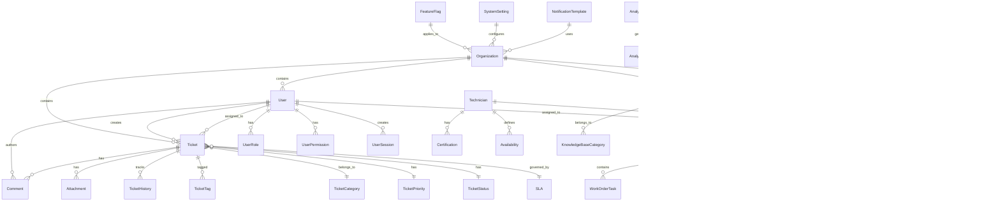

# 🗄️ **Database Schema Documentation**

**Version:** 1.0.0  
**Last Updated:** October 13, 2025

## 📋 **Table of Contents**

- [Schema Overview](#schema-overview)
- [Entity Relationship Diagram](#entity-relationship-diagram)
- [Core Tables](#core-tables)
- [User Management](#user-management)
- [Ticket Management](#ticket-management)
- [Field Service](#field-service)
- [Knowledge Base](#knowledge-base)
- [Analytics & Reporting](#analytics--reporting)
- [System Configuration](#system-configuration)
- [Indexes & Constraints](#indexes--constraints)
- [Data Relationships](#data-relationships)
- [Performance Optimization](#performance-optimization)

---

## 🎯 **Schema Overview**

The database schema is designed to support a multi-tenant helpdesk and field service management system with the following key characteristics:

### **Design Principles**
- **Multi-tenancy**: Complete tenant data isolation
- **Scalability**: Optimized for high-volume operations
- **Performance**: Strategic indexing and query optimization
- **Data Integrity**: Comprehensive constraints and validations
- **Audit Trail**: Complete change tracking and history

### **Database Technology**
- **Primary Database**: PostgreSQL 15 with PostGIS extension
- **Cache Layer**: Redis 7 for session and application caching
- **Search Engine**: Elasticsearch for full-text search capabilities
- **Message Queue**: Redis for asynchronous task processing

---

## 🏗️ **Entity Relationship Diagram**



---

## 👥 **User Management**

### **Core User Tables**

#### **organizations_organization**
```sql
CREATE TABLE organizations_organization (
    id UUID PRIMARY KEY DEFAULT gen_random_uuid(),
    name VARCHAR(255) NOT NULL,
    slug VARCHAR(100) UNIQUE NOT NULL,
    domain VARCHAR(255),
    settings JSONB DEFAULT '{}',
    subscription JSONB DEFAULT '{}',
    is_active BOOLEAN DEFAULT TRUE,
    created_at TIMESTAMP WITH TIME ZONE DEFAULT NOW(),
    updated_at TIMESTAMP WITH TIME ZONE DEFAULT NOW(),
    created_by UUID REFERENCES auth_user(id),
    updated_by UUID REFERENCES auth_user(id)
);

-- Indexes
CREATE INDEX idx_organizations_slug ON organizations_organization(slug);
CREATE INDEX idx_organizations_domain ON organizations_organization(domain);
CREATE INDEX idx_organizations_active ON organizations_organization(is_active);
```

#### **auth_user**
```sql
CREATE TABLE auth_user (
    id UUID PRIMARY KEY DEFAULT gen_random_uuid(),
    username VARCHAR(150) UNIQUE NOT NULL,
    email VARCHAR(254) UNIQUE NOT NULL,
    first_name VARCHAR(150),
    last_name VARCHAR(150),
    phone VARCHAR(20),
    avatar VARCHAR(500),
    timezone VARCHAR(50) DEFAULT 'UTC',
    language VARCHAR(10) DEFAULT 'en',
    is_verified BOOLEAN DEFAULT FALSE,
    is_agent BOOLEAN DEFAULT FALSE,
    is_customer BOOLEAN DEFAULT FALSE,
    is_technician BOOLEAN DEFAULT FALSE,
    last_active_at TIMESTAMP WITH TIME ZONE,
    organization_id UUID REFERENCES organizations_organization(id),
    created_at TIMESTAMP WITH TIME ZONE DEFAULT NOW(),
    updated_at TIMESTAMP WITH TIME ZONE DEFAULT NOW()
);

-- Indexes
CREATE INDEX idx_auth_user_email ON auth_user(email);
CREATE INDEX idx_auth_user_organization ON auth_user(organization_id);
CREATE INDEX idx_auth_user_active ON auth_user(last_active_at);
CREATE INDEX idx_auth_user_roles ON auth_user(is_agent, is_customer, is_technician);
```

#### **user_roles**
```sql
CREATE TABLE user_roles (
    id UUID PRIMARY KEY DEFAULT gen_random_uuid(),
    user_id UUID REFERENCES auth_user(id) ON DELETE CASCADE,
    role_name VARCHAR(50) NOT NULL,
    permissions JSONB DEFAULT '[]',
    is_active BOOLEAN DEFAULT TRUE,
    granted_by UUID REFERENCES auth_user(id),
    granted_at TIMESTAMP WITH TIME ZONE DEFAULT NOW(),
    expires_at TIMESTAMP WITH TIME ZONE,
    
    UNIQUE(user_id, role_name)
);

-- Indexes
CREATE INDEX idx_user_roles_user ON user_roles(user_id);
CREATE INDEX idx_user_roles_role ON user_roles(role_name);
CREATE INDEX idx_user_roles_active ON user_roles(is_active);
```

---

## 🎫 **Ticket Management**

### **Core Ticket Tables**

#### **tickets_ticket**
```sql
CREATE TABLE tickets_ticket (
    id UUID PRIMARY KEY DEFAULT gen_random_uuid(),
    title VARCHAR(255) NOT NULL,
    description TEXT,
    status VARCHAR(20) DEFAULT 'open',
    priority VARCHAR(20) DEFAULT 'medium',
    category_id UUID REFERENCES tickets_category(id),
    assigned_to_id UUID REFERENCES auth_user(id),
    created_by_id UUID REFERENCES auth_user(id),
    organization_id UUID REFERENCES organizations_organization(id),
    due_date TIMESTAMP WITH TIME ZONE,
    sla_status JSONB DEFAULT '{}',
    custom_fields JSONB DEFAULT '{}',
    is_public BOOLEAN DEFAULT TRUE,
    created_at TIMESTAMP WITH TIME ZONE DEFAULT NOW(),
    updated_at TIMESTAMP WITH TIME ZONE DEFAULT NOW()
);

-- Indexes
CREATE INDEX idx_tickets_organization ON tickets_ticket(organization_id);
CREATE INDEX idx_tickets_status ON tickets_ticket(status);
CREATE INDEX idx_tickets_priority ON tickets_ticket(priority);
CREATE INDEX idx_tickets_assigned ON tickets_ticket(assigned_to_id);
CREATE INDEX idx_tickets_created_by ON tickets_ticket(created_by_id);
CREATE INDEX idx_tickets_category ON tickets_ticket(category_id);
CREATE INDEX idx_tickets_due_date ON tickets_ticket(due_date);
CREATE INDEX idx_tickets_created_at ON tickets_ticket(created_at);
```

#### **tickets_category**
```sql
CREATE TABLE tickets_category (
    id UUID PRIMARY KEY DEFAULT gen_random_uuid(),
    name VARCHAR(100) NOT NULL,
    description TEXT,
    color VARCHAR(7) DEFAULT '#007bff',
    icon VARCHAR(50) DEFAULT 'fas fa-ticket',
    parent_id UUID REFERENCES tickets_category(id),
    organization_id UUID REFERENCES organizations_organization(id),
    is_active BOOLEAN DEFAULT TRUE,
    sort_order INTEGER DEFAULT 0,
    created_at TIMESTAMP WITH TIME ZONE DEFAULT NOW(),
    updated_at TIMESTAMP WITH TIME ZONE DEFAULT NOW(),
    
    UNIQUE(name, organization_id)
);

-- Indexes
CREATE INDEX idx_tickets_category_org ON tickets_category(organization_id);
CREATE INDEX idx_tickets_category_parent ON tickets_category(parent_id);
CREATE INDEX idx_tickets_category_active ON tickets_category(is_active);
```

#### **tickets_comment**
```sql
CREATE TABLE tickets_comment (
    id UUID PRIMARY KEY DEFAULT gen_random_uuid(),
    ticket_id UUID REFERENCES tickets_ticket(id) ON DELETE CASCADE,
    author_id UUID REFERENCES auth_user(id),
    content TEXT NOT NULL,
    is_internal BOOLEAN DEFAULT FALSE,
    mentions JSONB DEFAULT '[]',
    created_at TIMESTAMP WITH TIME ZONE DEFAULT NOW(),
    updated_at TIMESTAMP WITH TIME ZONE DEFAULT NOW()
);

-- Indexes
CREATE INDEX idx_tickets_comment_ticket ON tickets_comment(ticket_id);
CREATE INDEX idx_tickets_comment_author ON tickets_comment(author_id);
CREATE INDEX idx_tickets_comment_created ON tickets_comment(created_at);
```

#### **tickets_attachment**
```sql
CREATE TABLE tickets_attachment (
    id UUID PRIMARY KEY DEFAULT gen_random_uuid(),
    ticket_id UUID REFERENCES tickets_ticket(id) ON DELETE CASCADE,
    comment_id UUID REFERENCES tickets_comment(id) ON DELETE CASCADE,
    filename VARCHAR(255) NOT NULL,
    file_size BIGINT NOT NULL,
    mime_type VARCHAR(100) NOT NULL,
    file_path VARCHAR(500) NOT NULL,
    uploaded_by_id UUID REFERENCES auth_user(id),
    created_at TIMESTAMP WITH TIME ZONE DEFAULT NOW()
);

-- Indexes
CREATE INDEX idx_tickets_attachment_ticket ON tickets_attachment(ticket_id);
CREATE INDEX idx_tickets_attachment_comment ON tickets_attachment(comment_id);
CREATE INDEX idx_tickets_attachment_uploader ON tickets_attachment(uploaded_by_id);
```

---

## 🔧 **Field Service**

### **Field Service Tables**

#### **field_service_workorder**
```sql
CREATE TABLE field_service_workorder (
    id UUID PRIMARY KEY DEFAULT gen_random_uuid(),
    title VARCHAR(255) NOT NULL,
    description TEXT,
    status VARCHAR(20) DEFAULT 'scheduled',
    priority VARCHAR(20) DEFAULT 'medium',
    assigned_technician_id UUID REFERENCES auth_user(id),
    customer_id UUID REFERENCES field_service_customer(id),
    location_id UUID REFERENCES field_service_location(id),
    scheduled_at TIMESTAMP WITH TIME ZONE,
    estimated_duration INTEGER, -- minutes
    actual_duration INTEGER, -- minutes
    notes TEXT,
    customer_signature TEXT,
    photos JSONB DEFAULT '[]',
    custom_fields JSONB DEFAULT '{}',
    organization_id UUID REFERENCES organizations_organization(id),
    created_at TIMESTAMP WITH TIME ZONE DEFAULT NOW(),
    updated_at TIMESTAMP WITH TIME ZONE DEFAULT NOW()
);

-- Indexes
CREATE INDEX idx_workorder_organization ON field_service_workorder(organization_id);
CREATE INDEX idx_workorder_status ON field_service_workorder(status);
CREATE INDEX idx_workorder_priority ON field_service_workorder(priority);
CREATE INDEX idx_workorder_technician ON field_service_workorder(assigned_technician_id);
CREATE INDEX idx_workorder_customer ON field_service_workorder(customer_id);
CREATE INDEX idx_workorder_scheduled ON field_service_workorder(scheduled_at);
```

#### **field_service_customer**
```sql
CREATE TABLE field_service_customer (
    id UUID PRIMARY KEY DEFAULT gen_random_uuid(),
    name VARCHAR(255) NOT NULL,
    email VARCHAR(254),
    phone VARCHAR(20),
    address JSONB DEFAULT '{}',
    tier VARCHAR(20) DEFAULT 'bronze',
    notes TEXT,
    custom_fields JSONB DEFAULT '{}',
    organization_id UUID REFERENCES organizations_organization(id),
    created_at TIMESTAMP WITH TIME ZONE DEFAULT NOW(),
    updated_at TIMESTAMP WITH TIME ZONE DEFAULT NOW()
);

-- Indexes
CREATE INDEX idx_customer_organization ON field_service_customer(organization_id);
CREATE INDEX idx_customer_email ON field_service_customer(email);
CREATE INDEX idx_customer_tier ON field_service_customer(tier);
```

#### **field_service_location**
```sql
CREATE TABLE field_service_location (
    id UUID PRIMARY KEY DEFAULT gen_random_uuid(),
    name VARCHAR(255) NOT NULL,
    address JSONB NOT NULL,
    coordinates POINT, -- PostGIS point
    access_instructions TEXT,
    contact_person VARCHAR(255),
    contact_phone VARCHAR(20),
    organization_id UUID REFERENCES organizations_organization(id),
    created_at TIMESTAMP WITH TIME ZONE DEFAULT NOW(),
    updated_at TIMESTAMP WITH TIME ZONE DEFAULT NOW()
);

-- Indexes
CREATE INDEX idx_location_organization ON field_service_location(organization_id);
CREATE INDEX idx_location_coordinates ON field_service_location USING GIST(coordinates);
```

#### **field_service_equipment**
```sql
CREATE TABLE field_service_equipment (
    id UUID PRIMARY KEY DEFAULT gen_random_uuid(),
    name VARCHAR(255) NOT NULL,
    model VARCHAR(100),
    serial_number VARCHAR(100),
    manufacturer VARCHAR(100),
    installation_date DATE,
    warranty_expires DATE,
    status VARCHAR(20) DEFAULT 'operational',
    location_id UUID REFERENCES field_service_location(id),
    organization_id UUID REFERENCES organizations_organization(id),
    created_at TIMESTAMP WITH TIME ZONE DEFAULT NOW(),
    updated_at TIMESTAMP WITH TIME ZONE DEFAULT NOW()
);

-- Indexes
CREATE INDEX idx_equipment_organization ON field_service_equipment(organization_id);
CREATE INDEX idx_equipment_location ON field_service_equipment(location_id);
CREATE INDEX idx_equipment_status ON field_service_equipment(status);
CREATE INDEX idx_equipment_serial ON field_service_equipment(serial_number);
```

---

## 📚 **Knowledge Base**

### **Knowledge Base Tables**

#### **knowledge_base_article**
```sql
CREATE TABLE knowledge_base_article (
    id UUID PRIMARY KEY DEFAULT gen_random_uuid(),
    title VARCHAR(255) NOT NULL,
    content TEXT NOT NULL,
    summary TEXT,
    category_id UUID REFERENCES knowledge_base_category(id),
    author_id UUID REFERENCES auth_user(id),
    status VARCHAR(20) DEFAULT 'draft',
    views INTEGER DEFAULT 0,
    helpful_votes INTEGER DEFAULT 0,
    not_helpful_votes INTEGER DEFAULT 0,
    seo_title VARCHAR(255),
    seo_description TEXT,
    seo_keywords TEXT,
    organization_id UUID REFERENCES organizations_organization(id),
    created_at TIMESTAMP WITH TIME ZONE DEFAULT NOW(),
    updated_at TIMESTAMP WITH TIME ZONE DEFAULT NOW()
);

-- Indexes
CREATE INDEX idx_kb_article_organization ON knowledge_base_article(organization_id);
CREATE INDEX idx_kb_article_category ON knowledge_base_article(category_id);
CREATE INDEX idx_kb_article_author ON knowledge_base_article(author_id);
CREATE INDEX idx_kb_article_status ON knowledge_base_article(status);
CREATE INDEX idx_kb_article_views ON knowledge_base_article(views);
CREATE INDEX idx_kb_article_created ON knowledge_base_article(created_at);
```

#### **knowledge_base_category**
```sql
CREATE TABLE knowledge_base_category (
    id UUID PRIMARY KEY DEFAULT gen_random_uuid(),
    name VARCHAR(100) NOT NULL,
    description TEXT,
    parent_id UUID REFERENCES knowledge_base_category(id),
    organization_id UUID REFERENCES organizations_organization(id),
    is_active BOOLEAN DEFAULT TRUE,
    sort_order INTEGER DEFAULT 0,
    created_at TIMESTAMP WITH TIME ZONE DEFAULT NOW(),
    updated_at TIMESTAMP WITH TIME ZONE DEFAULT NOW(),
    
    UNIQUE(name, organization_id)
);

-- Indexes
CREATE INDEX idx_kb_category_organization ON knowledge_base_category(organization_id);
CREATE INDEX idx_kb_category_parent ON knowledge_base_category(parent_id);
CREATE INDEX idx_kb_category_active ON knowledge_base_category(is_active);
```

---

## 📊 **Analytics & Reporting**

### **Analytics Tables**

#### **analytics_event**
```sql
CREATE TABLE analytics_event (
    id UUID PRIMARY KEY DEFAULT gen_random_uuid(),
    event_type VARCHAR(100) NOT NULL,
    event_name VARCHAR(100) NOT NULL,
    user_id UUID REFERENCES auth_user(id),
    organization_id UUID REFERENCES organizations_organization(id),
    properties JSONB DEFAULT '{}',
    session_id VARCHAR(100),
    ip_address INET,
    user_agent TEXT,
    created_at TIMESTAMP WITH TIME ZONE DEFAULT NOW()
);

-- Indexes
CREATE INDEX idx_analytics_event_type ON analytics_event(event_type);
CREATE INDEX idx_analytics_event_name ON analytics_event(event_name);
CREATE INDEX idx_analytics_event_user ON analytics_event(user_id);
CREATE INDEX idx_analytics_event_organization ON analytics_event(organization_id);
CREATE INDEX idx_analytics_event_created ON analytics_event(created_at);
```

#### **analytics_dashboard**
```sql
CREATE TABLE analytics_dashboard (
    id UUID PRIMARY KEY DEFAULT gen_random_uuid(),
    name VARCHAR(255) NOT NULL,
    description TEXT,
    widgets JSONB DEFAULT '[]',
    layout JSONB DEFAULT '{}',
    filters JSONB DEFAULT '[]',
    is_public BOOLEAN DEFAULT FALSE,
    created_by_id UUID REFERENCES auth_user(id),
    organization_id UUID REFERENCES organizations_organization(id),
    created_at TIMESTAMP WITH TIME ZONE DEFAULT NOW(),
    updated_at TIMESTAMP WITH TIME ZONE DEFAULT NOW()
);

-- Indexes
CREATE INDEX idx_analytics_dashboard_organization ON analytics_dashboard(organization_id);
CREATE INDEX idx_analytics_dashboard_created_by ON analytics_dashboard(created_by_id);
CREATE INDEX idx_analytics_dashboard_public ON analytics_dashboard(is_public);
```

---

## ⚙️ **System Configuration**

### **Configuration Tables**

#### **system_settings**
```sql
CREATE TABLE system_settings (
    id UUID PRIMARY KEY DEFAULT gen_random_uuid(),
    key VARCHAR(100) NOT NULL,
    value JSONB NOT NULL,
    description TEXT,
    category VARCHAR(50) DEFAULT 'general',
    is_public BOOLEAN DEFAULT FALSE,
    organization_id UUID REFERENCES organizations_organization(id),
    created_at TIMESTAMP WITH TIME ZONE DEFAULT NOW(),
    updated_at TIMESTAMP WITH TIME ZONE DEFAULT NOW(),
    
    UNIQUE(key, organization_id)
);

-- Indexes
CREATE INDEX idx_system_settings_key ON system_settings(key);
CREATE INDEX idx_system_settings_organization ON system_settings(organization_id);
CREATE INDEX idx_system_settings_category ON system_settings(category);
```

#### **feature_flags**
```sql
CREATE TABLE feature_flags (
    id UUID PRIMARY KEY DEFAULT gen_random_uuid(),
    name VARCHAR(100) NOT NULL,
    description TEXT,
    is_active BOOLEAN DEFAULT FALSE,
    rollout_percentage INTEGER DEFAULT 0,
    target_users JSONB DEFAULT '[]',
    target_organizations JSONB DEFAULT '[]',
    conditions JSONB DEFAULT '{}',
    organization_id UUID REFERENCES organizations_organization(id),
    created_at TIMESTAMP WITH TIME ZONE DEFAULT NOW(),
    updated_at TIMESTAMP WITH TIME ZONE DEFAULT NOW(),
    
    UNIQUE(name, organization_id)
);

-- Indexes
CREATE INDEX idx_feature_flags_name ON feature_flags(name);
CREATE INDEX idx_feature_flags_organization ON feature_flags(organization_id);
CREATE INDEX idx_feature_flags_active ON feature_flags(is_active);
```

---

## 🔗 **Data Relationships**

### **Key Relationships**

#### **Multi-Tenancy**
- All major tables include `organization_id` for tenant isolation
- Foreign key constraints ensure data integrity
- Indexes optimize tenant-based queries

#### **User Relationships**
- Users belong to organizations
- Users can have multiple roles
- Users can be assigned to tickets and work orders

#### **Ticket Relationships**
- Tickets belong to organizations and users
- Tickets have categories, priorities, and statuses
- Tickets can have multiple comments and attachments

#### **Field Service Relationships**
- Work orders connect customers, technicians, and locations
- Equipment is associated with locations
- Work orders can have multiple tasks and materials

#### **Knowledge Base Relationships**
- Articles belong to categories and organizations
- Categories can have parent-child relationships
- Articles track views and votes

---

## 🚀 **Performance Optimization**

### **Indexing Strategy**

#### **Primary Indexes**
- All primary keys are UUIDs with default generation
- Foreign key columns are indexed for join performance
- Frequently queried columns have dedicated indexes

#### **Composite Indexes**
```sql
-- Multi-column indexes for common query patterns
CREATE INDEX idx_tickets_org_status ON tickets_ticket(organization_id, status);
CREATE INDEX idx_tickets_org_priority ON tickets_ticket(organization_id, priority);
CREATE INDEX idx_tickets_org_created ON tickets_ticket(organization_id, created_at);
CREATE INDEX idx_workorder_org_status ON field_service_workorder(organization_id, status);
CREATE INDEX idx_workorder_org_scheduled ON field_service_workorder(organization_id, scheduled_at);
```

#### **Partial Indexes**
```sql
-- Indexes for specific conditions
CREATE INDEX idx_tickets_open ON tickets_ticket(organization_id, created_at) 
WHERE status = 'open';
CREATE INDEX idx_workorder_scheduled ON field_service_workorder(organization_id, scheduled_at) 
WHERE status = 'scheduled';
```

### **Query Optimization**

#### **Common Query Patterns**
- Tenant-based filtering (organization_id)
- Status-based filtering
- Date range queries
- User-specific data access

#### **Performance Monitoring**
- Query execution time tracking
- Index usage analysis
- Slow query identification
- Database performance metrics

---

## 📈 **Scalability Considerations**

### **Horizontal Scaling**
- Tenant-based data partitioning
- Read replica configuration
- Connection pooling
- Caching strategies

### **Data Archiving**
- Historical data archiving
- Log data retention policies
- Backup and recovery procedures
- Data lifecycle management

### **Monitoring**
- Database performance metrics
- Query performance analysis
- Resource utilization tracking
- Alerting and notification

---

## 🔧 **Maintenance Procedures**

### **Regular Maintenance**
- Index maintenance and optimization
- Statistics updates
- Vacuum and analyze operations
- Backup verification

### **Data Integrity**
- Constraint validation
- Foreign key integrity checks
- Data consistency verification
- Audit trail maintenance

### **Security**
- Access control management
- Data encryption
- Audit logging
- Vulnerability assessments

---

**Last Updated**: October 13, 2025  
**Next Review**: November 13, 2025  
**Maintained By**: Database Team
