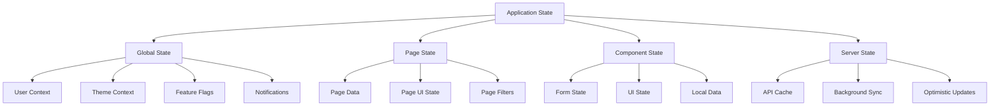
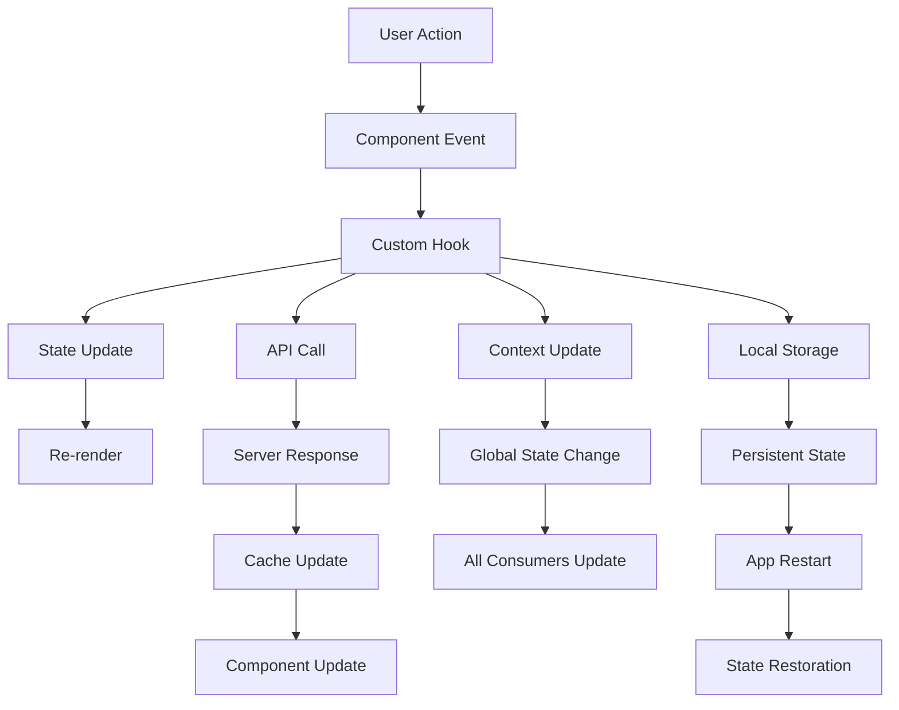
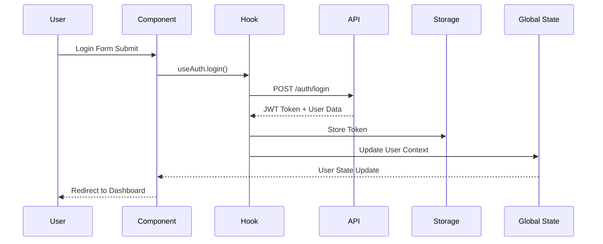
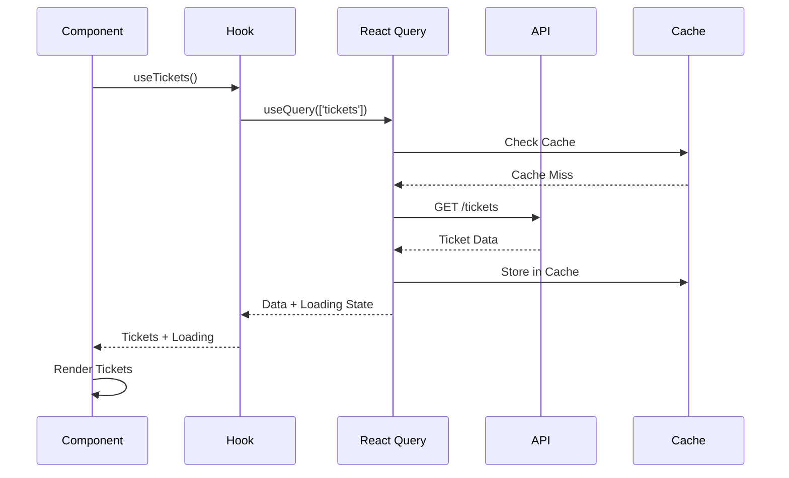

# 🔄 **State Management Documentation**

**Version:** 1.0.0  
**Last Updated:** October 13, 2025

## 📋 **Table of Contents**

- [State Management Overview](#state-management-overview)
- [State Architecture](#state-architecture)
- [State Categories](#state-categories)
- [State Management Patterns](#state-management-patterns)
- [Data Flow Diagrams](#data-flow-diagrams)
- [Implementation Examples](#implementation-examples)
- [Best Practices](#best-practices)
- [Performance Optimization](#performance-optimization)
- [Testing Strategy](#testing-strategy)
- [Migration Guide](#migration-guide)

---

## 🎯 **State Management Overview**

The Helpdesk Platform uses a comprehensive state management strategy that combines multiple approaches to handle different types of state efficiently. Our state management is built on React's built-in state management capabilities, enhanced with React Query for server state, and custom hooks for business logic.

### **State Management Philosophy**
- **Separation of Concerns**: Different types of state are managed with appropriate tools
- **Performance First**: Optimized for minimal re-renders and efficient updates
- **Developer Experience**: Intuitive APIs and excellent TypeScript support
- **Scalability**: Patterns that scale with application complexity
- **Maintainability**: Clear patterns and consistent implementation

### **Technology Stack**
- **React Hooks**: useState, useEffect, useContext, useReducer
- **React Query**: Server state management and caching
- **Custom Hooks**: Business logic encapsulation
- **Context API**: Global state management
- **Local Storage**: Persistent client state
- **URL State**: Navigation and routing state

---

## 🏗️ **State Architecture**

### **State Management Layers**



### **State Management Tools**

| **State Type** | **Tool** | **Use Case** | **Example** |
|----------------|----------|--------------|-------------|
| **Local Component** | useState | Form inputs, UI toggles | `const [isOpen, setIsOpen] = useState(false)` |
| **Complex Local** | useReducer | Complex state logic | Form validation, multi-step wizards |
| **Global App** | Context API | User, theme, settings | User authentication, theme preferences |
| **Server Data** | React Query | API data, caching | Tickets, users, work orders |
| **Persistent** | Local Storage | User preferences | Theme, language, filters |
| **URL State** | React Router | Navigation, filters | Current page, search params |

---

## 📊 **State Categories**

### **1. Local Component State**

#### **Form State Management**
```typescript
// Simple form state
const [formData, setFormData] = useState({
  title: '',
  description: '',
  priority: 'medium',
  category: ''
});

// Complex form with validation
const useTicketForm = (initialData?: Partial<TicketFormData>) => {
  const [formData, setFormData] = useState<TicketFormData>({
    title: '',
    description: '',
    priority: 'medium',
    category_id: '',
    assigned_to_id: '',
    tags: [],
    ...initialData
  });

  const [errors, setErrors] = useState<FormErrors>({});
  const [touched, setTouched] = useState<Record<string, boolean>>({});

  const setValue = (name: string, value: any) => {
    setFormData(prev => ({ ...prev, [name]: value }));
    if (errors[name]) {
      setErrors(prev => ({ ...prev, [name]: '' }));
    }
  };

  const setError = (name: string, error: string) => {
    setErrors(prev => ({ ...prev, [name]: error }));
  };

  const setTouched = (name: string, touched: boolean) => {
    setTouched(prev => ({ ...prev, [name]: touched }));
  };

  const validate = () => {
    const newErrors: FormErrors = {};
    
    if (!formData.title.trim()) {
      newErrors.title = 'Title is required';
    }
    
    if (!formData.description.trim()) {
      newErrors.description = 'Description is required';
    }
    
    setErrors(newErrors);
    return Object.keys(newErrors).length === 0;
  };

  const reset = () => {
    setFormData({
      title: '',
      description: '',
      priority: 'medium',
      category_id: '',
      assigned_to_id: '',
      tags: []
    });
    setErrors({});
    setTouched({});
  };

  return {
    formData,
    errors,
    touched,
    setValue,
    setError,
    setTouched,
    validate,
    reset,
    isValid: Object.keys(errors).length === 0
  };
};
```

#### **UI State Management**
```typescript
// Modal state
const useModal = (initialOpen = false) => {
  const [isOpen, setIsOpen] = useState(initialOpen);
  
  const open = useCallback(() => setIsOpen(true), []);
  const close = useCallback(() => setIsOpen(false), []);
  const toggle = useCallback(() => setIsOpen(prev => !prev), []);
  
  return { isOpen, open, close, toggle };
};

// Loading state
const useLoading = (initialLoading = false) => {
  const [loading, setLoading] = useState(initialLoading);
  
  const startLoading = useCallback(() => setLoading(true), []);
  const stopLoading = useCallback(() => setLoading(false), []);
  
  return { loading, startLoading, stopLoading };
};

// Toggle state
const useToggle = (initialValue = false) => {
  const [value, setValue] = useState(initialValue);
  
  const toggle = useCallback(() => setValue(prev => !prev), []);
  const setTrue = useCallback(() => setValue(true), []);
  const setFalse = useCallback(() => setValue(false), []);
  
  return { value, toggle, setTrue, setFalse };
};
```

### **2. Global Application State**

#### **User Context**
```typescript
interface UserContextType {
  user: User | null;
  organization: Organization | null;
  permissions: string[];
  isAuthenticated: boolean;
  login: (credentials: LoginCredentials) => Promise<void>;
  logout: () => void;
  updateUser: (user: Partial<User>) => void;
  refreshUser: () => Promise<void>;
}

const UserContext = createContext<UserContextType | null>(null);

export const UserProvider: React.FC<{ children: React.ReactNode }> = ({ children }) => {
  const [user, setUser] = useState<User | null>(null);
  const [organization, setOrganization] = useState<Organization | null>(null);
  const [permissions, setPermissions] = useState<string[]>([]);

  const login = async (credentials: LoginCredentials) => {
    try {
      const response = await authAPI.login(credentials);
      const { user, organization, permissions, access_token } = response;
      
      setUser(user);
      setOrganization(organization);
      setPermissions(permissions);
      
      // Store token in localStorage
      localStorage.setItem('access_token', access_token);
      
      // Set up API client with token
      apiClient.setAuthToken(access_token);
    } catch (error) {
      throw new Error('Login failed');
    }
  };

  const logout = () => {
    setUser(null);
    setOrganization(null);
    setPermissions([]);
    localStorage.removeItem('access_token');
    apiClient.clearAuthToken();
  };

  const updateUser = (userData: Partial<User>) => {
    setUser(prev => prev ? { ...prev, ...userData } : null);
  };

  const refreshUser = async () => {
    try {
      const userData = await authAPI.getCurrentUser();
      setUser(userData);
    } catch (error) {
      logout();
    }
  };

  const value: UserContextType = {
    user,
    organization,
    permissions,
    isAuthenticated: !!user,
    login,
    logout,
    updateUser,
    refreshUser
  };

  return (
    <UserContext.Provider value={value}>
      {children}
    </UserContext.Provider>
  );
};

export const useUser = () => {
  const context = useContext(UserContext);
  if (!context) {
    throw new Error('useUser must be used within UserProvider');
  }
  return context;
};
```

#### **Theme Context**
```typescript
interface ThemeContextType {
  theme: Theme;
  setTheme: (theme: Theme) => void;
  toggleTheme: () => void;
}

const ThemeContext = createContext<ThemeContextType | null>(null);

export const ThemeProvider: React.FC<{ children: React.ReactNode }> = ({ children }) => {
  const [theme, setTheme] = useState<Theme>(() => {
    const savedTheme = localStorage.getItem('theme');
    return (savedTheme as Theme) || 'light';
  });

  useEffect(() => {
    localStorage.setItem('theme', theme);
    document.documentElement.setAttribute('data-theme', theme);
  }, [theme]);

  const toggleTheme = useCallback(() => {
    setTheme(prev => prev === 'light' ? 'dark' : 'light');
  }, []);

  const value: ThemeContextType = {
    theme,
    setTheme,
    toggleTheme
  };

  return (
    <ThemeContext.Provider value={value}>
      {children}
    </ThemeContext.Provider>
  );
};

export const useTheme = () => {
  const context = useContext(ThemeContext);
  if (!context) {
    throw new Error('useTheme must be used within ThemeProvider');
  }
  return context;
};
```

#### **Notification Context**
```typescript
interface NotificationContextType {
  notifications: Notification[];
  addNotification: (notification: Omit<Notification, 'id'>) => void;
  removeNotification: (id: string) => void;
  clearNotifications: () => void;
  markAsRead: (id: string) => void;
  markAllAsRead: () => void;
}

const NotificationContext = createContext<NotificationContextType | null>(null);

export const NotificationProvider: React.FC<{ children: React.ReactNode }> = ({ children }) => {
  const [notifications, setNotifications] = useState<Notification[]>([]);

  const addNotification = useCallback((notification: Omit<Notification, 'id'>) => {
    const newNotification: Notification = {
      ...notification,
      id: generateId(),
      created_at: new Date().toISOString()
    };
    
    setNotifications(prev => [newNotification, ...prev]);
    
    // Auto-remove after duration
    if (notification.autoRemove !== false) {
      setTimeout(() => {
        removeNotification(newNotification.id);
      }, notification.duration || 5000);
    }
  }, []);

  const removeNotification = useCallback((id: string) => {
    setNotifications(prev => prev.filter(n => n.id !== id));
  }, []);

  const clearNotifications = useCallback(() => {
    setNotifications([]);
  }, []);

  const markAsRead = useCallback((id: string) => {
    setNotifications(prev => 
      prev.map(n => n.id === id ? { ...n, is_read: true } : n)
    );
  }, []);

  const markAllAsRead = useCallback(() => {
    setNotifications(prev => 
      prev.map(n => ({ ...n, is_read: true }))
    );
  }, []);

  const value: NotificationContextType = {
    notifications,
    addNotification,
    removeNotification,
    clearNotifications,
    markAsRead,
    markAllAsRead
  };

  return (
    <NotificationContext.Provider value={value}>
      {children}
    </NotificationContext.Provider>
  );
};

export const useNotifications = () => {
  const context = useContext(NotificationContext);
  if (!context) {
    throw new Error('useNotifications must be used within NotificationProvider');
  }
  return context;
};
```

### **3. Server State Management**

#### **React Query Configuration**
```typescript
import { QueryClient, QueryClientProvider } from '@tanstack/react-query';
import { ReactQueryDevtools } from '@tanstack/react-query-devtools';

const queryClient = new QueryClient({
  defaultOptions: {
    queries: {
      staleTime: 5 * 60 * 1000, // 5 minutes
      cacheTime: 10 * 60 * 1000, // 10 minutes
      retry: 3,
      retryDelay: attemptIndex => Math.min(1000 * 2 ** attemptIndex, 30000),
      refetchOnWindowFocus: false,
      refetchOnReconnect: true
    },
    mutations: {
      retry: 1,
      retryDelay: 1000
    }
  }
});

export const App: React.FC = () => {
  return (
    <QueryClientProvider client={queryClient}>
      <AppContent />
      <ReactQueryDevtools initialIsOpen={false} />
    </QueryClientProvider>
  );
};
```

#### **Custom Hooks for Server State**
```typescript
// Tickets management
export const useTickets = (filters?: TicketFilters) => {
  return useQuery({
    queryKey: ['tickets', filters],
    queryFn: () => ticketsAPI.getTickets(filters),
    select: (data) => ({
      tickets: data.results,
      pagination: {
        count: data.count,
        next: data.next,
        previous: data.previous
      }
    })
  });
};

export const useTicket = (id: string) => {
  return useQuery({
    queryKey: ['tickets', id],
    queryFn: () => ticketsAPI.getTicket(id),
    enabled: !!id
  });
};

export const useCreateTicket = () => {
  const queryClient = useQueryClient();
  
  return useMutation({
    mutationFn: ticketsAPI.createTicket,
    onSuccess: (newTicket) => {
      // Invalidate and refetch tickets
      queryClient.invalidateQueries(['tickets']);
      
      // Optimistically update the cache
      queryClient.setQueryData(['tickets', newTicket.id], newTicket);
    },
    onError: (error) => {
      console.error('Failed to create ticket:', error);
    }
  });
};

export const useUpdateTicket = () => {
  const queryClient = useQueryClient();
  
  return useMutation({
    mutationFn: ({ id, data }: { id: string; data: Partial<Ticket> }) => 
      ticketsAPI.updateTicket(id, data),
    onSuccess: (updatedTicket, { id }) => {
      // Update the specific ticket in cache
      queryClient.setQueryData(['tickets', id], updatedTicket);
      
      // Invalidate tickets list to ensure consistency
      queryClient.invalidateQueries(['tickets']);
    }
  });
};

export const useDeleteTicket = () => {
  const queryClient = useQueryClient();
  
  return useMutation({
    mutationFn: ticketsAPI.deleteTicket,
    onSuccess: (_, id) => {
      // Remove from cache
      queryClient.removeQueries(['tickets', id]);
      
      // Invalidate tickets list
      queryClient.invalidateQueries(['tickets']);
    }
  });
};
```

#### **Work Orders Management**
```typescript
export const useWorkOrders = (filters?: WorkOrderFilters) => {
  return useQuery({
    queryKey: ['work-orders', filters],
    queryFn: () => workOrdersAPI.getWorkOrders(filters),
    select: (data) => ({
      workOrders: data.results,
      pagination: {
        count: data.count,
        next: data.next,
        previous: data.previous
      }
    })
  });
};

export const useWorkOrder = (id: string) => {
  return useQuery({
    queryKey: ['work-orders', id],
    queryFn: () => workOrdersAPI.getWorkOrder(id),
    enabled: !!id
  });
};

export const useCreateWorkOrder = () => {
  const queryClient = useQueryClient();
  
  return useMutation({
    mutationFn: workOrdersAPI.createWorkOrder,
    onSuccess: (newWorkOrder) => {
      queryClient.invalidateQueries(['work-orders']);
      queryClient.setQueryData(['work-orders', newWorkOrder.id], newWorkOrder);
    }
  });
};
```

### **4. Persistent State Management**

#### **Local Storage Hook**
```typescript
export const useLocalStorage = <T>(
  key: string, 
  initialValue: T
): [T, (value: T | ((val: T) => T)) => void] => {
  const [storedValue, setStoredValue] = useState<T>(() => {
    try {
      const item = window.localStorage.getItem(key);
      return item ? JSON.parse(item) : initialValue;
    } catch (error) {
      console.error(`Error reading localStorage key "${key}":`, error);
      return initialValue;
    }
  });

  const setValue = useCallback((value: T | ((val: T) => T)) => {
    try {
      const valueToStore = value instanceof Function ? value(storedValue) : value;
      setStoredValue(valueToStore);
      window.localStorage.setItem(key, JSON.stringify(valueToStore));
    } catch (error) {
      console.error(`Error setting localStorage key "${key}":`, error);
    }
  }, [key, storedValue]);

  return [storedValue, setValue];
};

// Usage examples
const useUserPreferences = () => {
  const [theme, setTheme] = useLocalStorage('theme', 'light');
  const [language, setLanguage] = useLocalStorage('language', 'en');
  const [notifications, setNotifications] = useLocalStorage('notifications', {
    email: true,
    push: true,
    sms: false
  });

  return {
    theme,
    setTheme,
    language,
    setLanguage,
    notifications,
    setNotifications
  };
};
```

#### **Session Storage Hook**
```typescript
export const useSessionStorage = <T>(
  key: string, 
  initialValue: T
): [T, (value: T | ((val: T) => T)) => void] => {
  const [storedValue, setStoredValue] = useState<T>(() => {
    try {
      const item = window.sessionStorage.getItem(key);
      return item ? JSON.parse(item) : initialValue;
    } catch (error) {
      console.error(`Error reading sessionStorage key "${key}":`, error);
      return initialValue;
    }
  });

  const setValue = useCallback((value: T | ((val: T) => T)) => {
    try {
      const valueToStore = value instanceof Function ? value(storedValue) : value;
      setStoredValue(valueToStore);
      window.sessionStorage.setItem(key, JSON.stringify(valueToStore));
    } catch (error) {
      console.error(`Error setting sessionStorage key "${key}":`, error);
    }
  }, [key, storedValue]);

  return [storedValue, setValue];
};
```

---

## 🔄 **State Management Patterns**

### **1. Custom Hooks Pattern**

#### **Business Logic Hooks**
```typescript
// Ticket management hook
export const useTicketManagement = () => {
  const queryClient = useQueryClient();
  const { addNotification } = useNotifications();

  const { data: tickets, isLoading, error } = useTickets();
  
  const createTicketMutation = useCreateTicket();
  const updateTicketMutation = useUpdateTicket();
  const deleteTicketMutation = useDeleteTicket();

  const createTicket = useCallback(async (data: CreateTicketData) => {
    try {
      const newTicket = await createTicketMutation.mutateAsync(data);
      addNotification({
        type: 'success',
        title: 'Ticket Created',
        message: `Ticket #${newTicket.id.slice(-8)} has been created successfully`
      });
      return newTicket;
    } catch (error) {
      addNotification({
        type: 'error',
        title: 'Failed to Create Ticket',
        message: 'There was an error creating the ticket. Please try again.'
      });
      throw error;
    }
  }, [createTicketMutation, addNotification]);

  const updateTicket = useCallback(async (id: string, data: UpdateTicketData) => {
    try {
      const updatedTicket = await updateTicketMutation.mutateAsync({ id, data });
      addNotification({
        type: 'success',
        title: 'Ticket Updated',
        message: `Ticket #${id.slice(-8)} has been updated successfully`
      });
      return updatedTicket;
    } catch (error) {
      addNotification({
        type: 'error',
        title: 'Failed to Update Ticket',
        message: 'There was an error updating the ticket. Please try again.'
      });
      throw error;
    }
  }, [updateTicketMutation, addNotification]);

  const deleteTicket = useCallback(async (id: string) => {
    try {
      await deleteTicketMutation.mutateAsync(id);
      addNotification({
        type: 'success',
        title: 'Ticket Deleted',
        message: `Ticket #${id.slice(-8)} has been deleted successfully`
      });
    } catch (error) {
      addNotification({
        type: 'error',
        title: 'Failed to Delete Ticket',
        message: 'There was an error deleting the ticket. Please try again.'
      });
      throw error;
    }
  }, [deleteTicketMutation, addNotification]);

  return {
    tickets: tickets?.tickets || [],
    pagination: tickets?.pagination,
    isLoading,
    error,
    createTicket,
    updateTicket,
    deleteTicket,
    isCreating: createTicketMutation.isLoading,
    isUpdating: updateTicketMutation.isLoading,
    isDeleting: deleteTicketMutation.isLoading
  };
};
```

#### **Form Management Hook**
```typescript
export const useForm = <T extends Record<string, any>>(
  initialValues: T,
  validationSchema?: ValidationSchema<T>
) => {
  const [values, setValues] = useState<T>(initialValues);
  const [errors, setErrors] = useState<Partial<Record<keyof T, string>>>({});
  const [touched, setTouched] = useState<Partial<Record<keyof T, boolean>>>({});
  const [isSubmitting, setIsSubmitting] = useState(false);

  const setValue = useCallback((name: keyof T, value: any) => {
    setValues(prev => ({ ...prev, [name]: value }));
    
    // Clear error when user starts typing
    if (errors[name]) {
      setErrors(prev => ({ ...prev, [name]: undefined }));
    }
  }, [errors]);

  const setError = useCallback((name: keyof T, error: string) => {
    setErrors(prev => ({ ...prev, [name]: error }));
  }, []);

  const setTouched = useCallback((name: keyof T, touched: boolean) => {
    setTouched(prev => ({ ...prev, [name]: touched }));
  }, []);

  const validate = useCallback(() => {
    if (!validationSchema) return true;

    const newErrors: Partial<Record<keyof T, string>> = {};
    
    Object.keys(validationSchema).forEach((key) => {
      const fieldName = key as keyof T;
      const rules = validationSchema[fieldName];
      const value = values[fieldName];

      if (rules.required && (!value || value.toString().trim() === '')) {
        newErrors[fieldName] = rules.required;
        return;
      }

      if (rules.minLength && value && value.toString().length < rules.minLength) {
        newErrors[fieldName] = rules.minLength;
        return;
      }

      if (rules.maxLength && value && value.toString().length > rules.maxLength) {
        newErrors[fieldName] = rules.maxLength;
        return;
      }

      if (rules.pattern && value && !rules.pattern.test(value.toString())) {
        newErrors[fieldName] = rules.pattern;
        return;
      }

      if (rules.custom && value) {
        const customError = rules.custom(value);
        if (customError) {
          newErrors[fieldName] = customError;
        }
      }
    });

    setErrors(newErrors);
    return Object.keys(newErrors).length === 0;
  }, [values, validationSchema]);

  const handleSubmit = useCallback(async (
    onSubmit: (values: T) => Promise<void> | void
  ) => {
    setIsSubmitting(true);
    
    try {
      if (validate()) {
        await onSubmit(values);
      }
    } finally {
      setIsSubmitting(false);
    }
  }, [validate, values]);

  const reset = useCallback(() => {
    setValues(initialValues);
    setErrors({});
    setTouched({});
    setIsSubmitting(false);
  }, [initialValues]);

  const isValid = Object.keys(errors).length === 0;

  return {
    values,
    errors,
    touched,
    isSubmitting,
    isValid,
    setValue,
    setError,
    setTouched,
    validate,
    handleSubmit,
    reset
  };
};
```

### **2. Context Pattern**

#### **Feature Flags Context**
```typescript
interface FeatureFlagContextType {
  flags: Record<string, boolean>;
  loading: boolean;
  error: Error | null;
  isEnabled: (flag: string) => boolean;
  refresh: () => Promise<void>;
}

const FeatureFlagContext = createContext<FeatureFlagContextType | null>(null);

export const FeatureFlagProvider: React.FC<{ children: React.ReactNode }> = ({ children }) => {
  const [flags, setFlags] = useState<Record<string, boolean>>({});
  const [loading, setLoading] = useState(true);
  const [error, setError] = useState<Error | null>(null);

  const fetchFlags = useCallback(async () => {
    try {
      setLoading(true);
      setError(null);
      
      const response = await featureFlagsAPI.getFlags();
      const flagsMap = response.reduce((acc, flag) => {
        acc[flag.name] = flag.is_active;
        return acc;
      }, {} as Record<string, boolean>);
      
      setFlags(flagsMap);
    } catch (err) {
      setError(err as Error);
      console.error('Failed to fetch feature flags:', err);
    } finally {
      setLoading(false);
    }
  }, []);

  const isEnabled = useCallback((flag: string) => {
    return flags[flag] || false;
  }, [flags]);

  useEffect(() => {
    fetchFlags();
  }, [fetchFlags]);

  const value: FeatureFlagContextType = {
    flags,
    loading,
    error,
    isEnabled,
    refresh: fetchFlags
  };

  return (
    <FeatureFlagContext.Provider value={value}>
      {children}
    </FeatureFlagContext.Provider>
  );
};

export const useFeatureFlag = (flag: string) => {
  const context = useContext(FeatureFlagContext);
  if (!context) {
    throw new Error('useFeatureFlag must be used within FeatureFlagProvider');
  }
  
  return {
    isEnabled: context.isEnabled(flag),
    loading: context.loading,
    error: context.error
  };
};
```

### **3. Reducer Pattern**

#### **Complex State with useReducer**
```typescript
interface TicketListState {
  tickets: Ticket[];
  loading: boolean;
  error: string | null;
  filters: TicketFilters;
  sorting: SortingOptions;
  pagination: PaginationOptions;
  selectedTickets: string[];
}

type TicketListAction =
  | { type: 'SET_LOADING'; payload: boolean }
  | { type: 'SET_ERROR'; payload: string | null }
  | { type: 'SET_TICKETS'; payload: Ticket[] }
  | { type: 'SET_FILTERS'; payload: TicketFilters }
  | { type: 'SET_SORTING'; payload: SortingOptions }
  | { type: 'SET_PAGINATION'; payload: PaginationOptions }
  | { type: 'SELECT_TICKET'; payload: string }
  | { type: 'DESELECT_TICKET'; payload: string }
  | { type: 'SELECT_ALL' }
  | { type: 'DESELECT_ALL' }
  | { type: 'RESET' };

const ticketListReducer = (state: TicketListState, action: TicketListAction): TicketListState => {
  switch (action.type) {
    case 'SET_LOADING':
      return { ...state, loading: action.payload };
    
    case 'SET_ERROR':
      return { ...state, error: action.payload, loading: false };
    
    case 'SET_TICKETS':
      return { ...state, tickets: action.payload, loading: false, error: null };
    
    case 'SET_FILTERS':
      return { ...state, filters: action.payload, pagination: { ...state.pagination, page: 1 } };
    
    case 'SET_SORTING':
      return { ...state, sorting: action.payload };
    
    case 'SET_PAGINATION':
      return { ...state, pagination: action.payload };
    
    case 'SELECT_TICKET':
      return { 
        ...state, 
        selectedTickets: [...state.selectedTickets, action.payload] 
      };
    
    case 'DESELECT_TICKET':
      return { 
        ...state, 
        selectedTickets: state.selectedTickets.filter(id => id !== action.payload) 
      };
    
    case 'SELECT_ALL':
      return { 
        ...state, 
        selectedTickets: state.tickets.map(ticket => ticket.id) 
      };
    
    case 'DESELECT_ALL':
      return { ...state, selectedTickets: [] };
    
    case 'RESET':
      return {
        tickets: [],
        loading: false,
        error: null,
        filters: {},
        sorting: {},
        pagination: { page: 1, pageSize: 20 },
        selectedTickets: []
      };
    
    default:
      return state;
  }
};

export const useTicketList = () => {
  const [state, dispatch] = useReducer(ticketListReducer, {
    tickets: [],
    loading: false,
    error: null,
    filters: {},
    sorting: {},
    pagination: { page: 1, pageSize: 20 },
    selectedTickets: []
  });

  const { data, isLoading, error } = useTickets(state.filters);

  useEffect(() => {
    if (data) {
      dispatch({ type: 'SET_TICKETS', payload: data.tickets });
    }
  }, [data]);

  useEffect(() => {
    dispatch({ type: 'SET_LOADING', payload: isLoading });
  }, [isLoading]);

  useEffect(() => {
    if (error) {
      dispatch({ type: 'SET_ERROR', payload: error.message });
    }
  }, [error]);

  const setFilters = useCallback((filters: TicketFilters) => {
    dispatch({ type: 'SET_FILTERS', payload: filters });
  }, []);

  const setSorting = useCallback((sorting: SortingOptions) => {
    dispatch({ type: 'SET_SORTING', payload: sorting });
  }, []);

  const setPagination = useCallback((pagination: PaginationOptions) => {
    dispatch({ type: 'SET_PAGINATION', payload: pagination });
  }, []);

  const selectTicket = useCallback((id: string) => {
    dispatch({ type: 'SELECT_TICKET', payload: id });
  }, []);

  const deselectTicket = useCallback((id: string) => {
    dispatch({ type: 'DESELECT_TICKET', payload: id });
  }, []);

  const selectAll = useCallback(() => {
    dispatch({ type: 'SELECT_ALL' });
  }, []);

  const deselectAll = useCallback(() => {
    dispatch({ type: 'DESELECT_ALL' });
  }, []);

  const reset = useCallback(() => {
    dispatch({ type: 'RESET' });
  }, []);

  return {
    ...state,
    setFilters,
    setSorting,
    setPagination,
    selectTicket,
    deselectTicket,
    selectAll,
    deselectAll,
    reset
  };
};
```

---

## 📊 **Data Flow Diagrams**

### **State Flow Architecture**



### **Authentication Flow**



### **Data Fetching Flow**



---

## 🚀 **Performance Optimization**

### **1. Memoization Strategies**

#### **React.memo for Components**
```typescript
const TicketCard = React.memo<TicketCardProps>(({ ticket, onEdit, onDelete }) => {
  return (
    <div className="ticket-card">
      <h3>{ticket.title}</h3>
      <p>{ticket.description}</p>
      <button onClick={() => onEdit(ticket)}>Edit</button>
      <button onClick={() => onDelete(ticket)}>Delete</button>
    </div>
  );
}, (prevProps, nextProps) => {
  // Custom comparison function
  return (
    prevProps.ticket.id === nextProps.ticket.id &&
    prevProps.ticket.updated_at === nextProps.ticket.updated_at &&
    prevProps.onEdit === nextProps.onEdit &&
    prevProps.onDelete === nextProps.onDelete
  );
});
```

#### **useMemo for Expensive Calculations**
```typescript
const TicketList = ({ tickets, filters, sorting }) => {
  const filteredTickets = useMemo(() => {
    return tickets.filter(ticket => {
      if (filters.status && ticket.status !== filters.status) return false;
      if (filters.priority && ticket.priority !== filters.priority) return false;
      if (filters.search && !ticket.title.toLowerCase().includes(filters.search.toLowerCase())) return false;
      return true;
    });
  }, [tickets, filters]);

  const sortedTickets = useMemo(() => {
    if (!sorting.field) return filteredTickets;
    
    return [...filteredTickets].sort((a, b) => {
      const aValue = a[sorting.field];
      const bValue = b[sorting.field];
      
      if (sorting.order === 'asc') {
        return aValue > bValue ? 1 : -1;
      } else {
        return aValue < bValue ? 1 : -1;
      }
    });
  }, [filteredTickets, sorting]);

  return (
    <div>
      {sortedTickets.map(ticket => (
        <TicketCard key={ticket.id} ticket={ticket} />
      ))}
    </div>
  );
};
```

#### **useCallback for Event Handlers**
```typescript
const TicketForm = ({ onSubmit }) => {
  const [formData, setFormData] = useState({});

  const handleSubmit = useCallback((e) => {
    e.preventDefault();
    onSubmit(formData);
  }, [formData, onSubmit]);

  const handleChange = useCallback((name, value) => {
    setFormData(prev => ({ ...prev, [name]: value }));
  }, []);

  return (
    <form onSubmit={handleSubmit}>
      <input onChange={(e) => handleChange('title', e.target.value)} />
      <button type="submit">Submit</button>
    </form>
  );
};
```

### **2. Query Optimization**

#### **Query Key Optimization**
```typescript
// Good: Specific query keys
const useTickets = (filters) => {
  return useQuery({
    queryKey: ['tickets', filters],
    queryFn: () => fetchTickets(filters)
  });
};

// Bad: Too broad query keys
const useTickets = () => {
  return useQuery({
    queryKey: ['tickets'],
    queryFn: fetchTickets
  });
};
```

#### **Selective Data Fetching**
```typescript
const useTicketSummary = (id) => {
  return useQuery({
    queryKey: ['tickets', id, 'summary'],
    queryFn: () => fetchTicketSummary(id),
    select: (data) => ({
      id: data.id,
      title: data.title,
      status: data.status,
      priority: data.priority
    })
  });
};
```

### **3. Context Optimization**

#### **Context Splitting**
```typescript
// Split large contexts into smaller ones
const UserContext = createContext();
const ThemeContext = createContext();
const NotificationContext = createContext();

// Instead of one large AppContext
const AppContext = createContext();
```

#### **Context Value Memoization**
```typescript
const UserProvider = ({ children }) => {
  const [user, setUser] = useState(null);
  const [loading, setLoading] = useState(false);

  const value = useMemo(() => ({
    user,
    loading,
    setUser,
    setLoading
  }), [user, loading]);

  return (
    <UserContext.Provider value={value}>
      {children}
    </UserContext.Provider>
  );
};
```

---

## 🧪 **Testing Strategy**

### **1. State Testing**

#### **Hook Testing**
```typescript
import { renderHook, act } from '@testing-library/react';
import { useTickets } from './useTickets';

describe('useTickets', () => {
  it('should fetch tickets on mount', async () => {
    const { result } = renderHook(() => useTickets());
    
    expect(result.current.isLoading).toBe(true);
    
    await waitFor(() => {
      expect(result.current.isLoading).toBe(false);
    });
    
    expect(result.current.tickets).toHaveLength(3);
  });

  it('should handle filters correctly', async () => {
    const filters = { status: 'open' };
    const { result } = renderHook(() => useTickets(filters));
    
    await waitFor(() => {
      expect(result.current.tickets).toHaveLength(2);
    });
  });
});
```

#### **Context Testing**
```typescript
import { render, screen } from '@testing-library/react';
import { UserProvider, useUser } from './UserContext';

const TestComponent = () => {
  const { user, isAuthenticated } = useUser();
  return (
    <div>
      {isAuthenticated ? `Welcome ${user?.first_name}` : 'Please login'}
    </div>
  );
};

describe('UserContext', () => {
  it('should provide user context', () => {
    render(
      <UserProvider>
        <TestComponent />
      </UserProvider>
    );
    
    expect(screen.getByText('Please login')).toBeInTheDocument();
  });
});
```

### **2. Integration Testing**

#### **Component State Integration**
```typescript
import { render, screen, fireEvent, waitFor } from '@testing-library/react';
import { QueryClient, QueryClientProvider } from '@tanstack/react-query';
import { TicketForm } from './TicketForm';

const createWrapper = () => {
  const queryClient = new QueryClient({
    defaultOptions: {
      queries: { retry: false },
      mutations: { retry: false }
    }
  });
  
  return ({ children }) => (
    <QueryClientProvider client={queryClient}>
      {children}
    </QueryClientProvider>
  );
};

describe('TicketForm', () => {
  it('should submit form with correct data', async () => {
    const onSubmit = jest.fn();
    
    render(<TicketForm onSubmit={onSubmit} />, { wrapper: createWrapper() });
    
    fireEvent.change(screen.getByLabelText('Title'), {
      target: { value: 'Test Ticket' }
    });
    
    fireEvent.change(screen.getByLabelText('Description'), {
      target: { value: 'Test Description' }
    });
    
    fireEvent.click(screen.getByRole('button', { name: /submit/i }));
    
    await waitFor(() => {
      expect(onSubmit).toHaveBeenCalledWith({
        title: 'Test Ticket',
        description: 'Test Description'
      });
    });
  });
});
```

---

## 📚 **Best Practices**

### **1. State Management Guidelines**

#### **Choose the Right Tool**
- **useState**: Simple local state
- **useReducer**: Complex state logic
- **Context**: Global state shared across components
- **React Query**: Server state and caching
- **Local Storage**: Persistent client state

#### **State Structure**
```typescript
// Good: Flat, normalized state
interface AppState {
  user: User | null;
  tickets: Record<string, Ticket>;
  workOrders: Record<string, WorkOrder>;
  ui: {
    modals: Record<string, boolean>;
    loading: Record<string, boolean>;
  };
}

// Bad: Nested, denormalized state
interface AppState {
  user: {
    profile: {
      personal: {
        name: string;
        email: string;
      };
    };
  };
}
```

#### **State Updates**
```typescript
// Good: Immutable updates
const updateTicket = (tickets, id, updates) => ({
  ...tickets,
  [id]: { ...tickets[id], ...updates }
});

// Bad: Mutating state
const updateTicket = (tickets, id, updates) => {
  tickets[id] = { ...tickets[id], ...updates };
  return tickets;
};
```

### **2. Performance Guidelines**

#### **Avoid Unnecessary Re-renders**
```typescript
// Good: Memoized callbacks
const TicketCard = ({ ticket, onEdit }) => {
  const handleEdit = useCallback(() => {
    onEdit(ticket);
  }, [ticket, onEdit]);

  return <div onClick={handleEdit}>{ticket.title}</div>;
};

// Bad: New function on every render
const TicketCard = ({ ticket, onEdit }) => {
  return <div onClick={() => onEdit(ticket)}>{ticket.title}</div>;
};
```

#### **Optimize Context Usage**
```typescript
// Good: Split contexts by concern
const UserContext = createContext();
const ThemeContext = createContext();

// Bad: Single large context
const AppContext = createContext();
```

### **3. Testing Guidelines**

#### **Test State Logic Separately**
```typescript
// Test custom hooks in isolation
describe('useTicketForm', () => {
  it('should validate required fields', () => {
    const { result } = renderHook(() => useTicketForm());
    
    act(() => {
      result.current.setValue('title', '');
    });
    
    expect(result.current.errors.title).toBe('Title is required');
  });
});
```

#### **Mock External Dependencies**
```typescript
// Mock API calls
jest.mock('./api', () => ({
  fetchTickets: jest.fn(),
  createTicket: jest.fn()
}));
```

---

**Last Updated**: October 13, 2025  
**Next Review**: November 13, 2025  
**Maintained By**: Frontend Team
